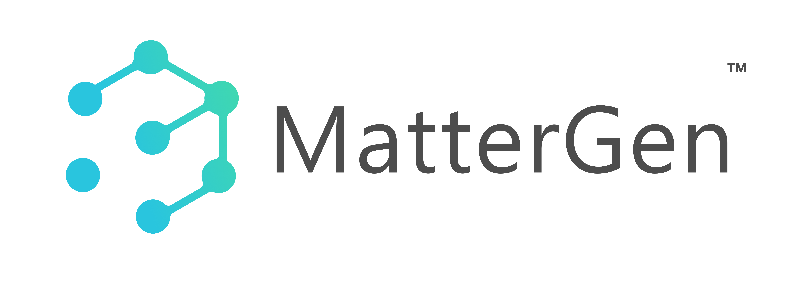
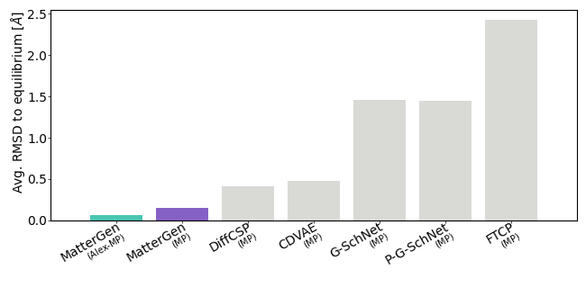
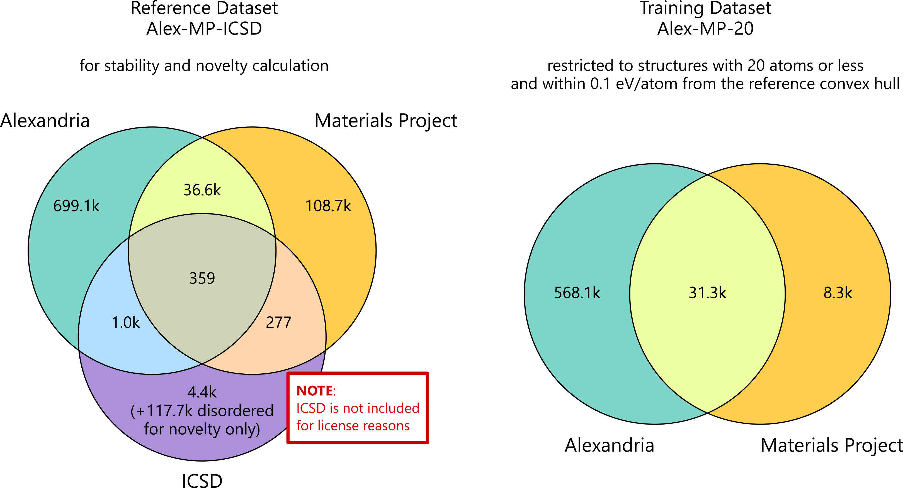

<!-- BEGIN THESIS EXPERIMENT BRANCH NOTICE -->
# MatterGen 学位论文项目：进度与分支说明

## 当前分支

> **分支：`feature/convergence-aware-corrector-gating`**<br>
> **角色：创新点一 Adaptive CFG 的正式科学来源分支**<br>
> **状态：`FORMAL_INNOVATION1_CONFIRMED=True`**

- 冻结代码/审计 commit：`5de00419eea2d8a9be303638f2db8ece15a22366`
- 当前结果：正式 seeds 20000–20255（256）；相对 C0：E-hull -0.003435 eV/atom、Stable +5.859 pp、NUS +3.516 pp。
- 论文用途：可用于创新点一正式主结论。

## 项目整体进度

| 工作项 | 最终状态 | 主要证据与结果 |
|---|---|---|
| 创新点一：Multi-field Residual-driven Online Adaptive CFG | **正式成立** | 256-seed 正式验证；`FORMAL_INNOVATION1_CONFIRMED=True` |
| 创新点二：Learned-Gated E3-PCR | **正式成立** | 256-seed 独立正式验证；最大力相对 C0 降低 23.28% |
| 两创新点组合验证 1 | **GO** | 41000–41063；A0+E3-G 最大力降低 27.10% |
| 两创新点组合验证 2 | **GO / 完全独立复现** | 50000–50063；A0+E3-G 最大力降低 19.02% |
| 训练重叠诊断 | **已完成，发现安全性乐观偏差** | overlap harm 0/64，held-out harm 31/192；Mixed 256 无正式资格 |
| 旧 A0 256 批次复用审计 | **SOURCE_DATA_INCOMPLETE** | 64 个 seeds 与 Gate 训练重叠；没有效果估计，不是方法 No-Go |
| 论文分析归档 | **THESIS_ARCHIVE_COMPLETED** | 181 个归档文件、逐 seed 数据、统计/表格/绘图脚本；Draft PR #18 |
| 历史候选路线 | **已完成 Go/No-Go 筛选** | No-Go 路线保留作过程与负面消融，不属于最终两个创新点 |

## 两个创新点的关系

创新点一在项目中是**共享基础模块（common/shared base）**，不是指 GitHub 仓库是公开的；本仓库仍为 **Private**。

```text
MatterGen 条件生成
  └─ 创新点一：Adaptive CFG（采样阶段，形成 A0）
       └─ 创新点二：Learned-Gated E3-PCR（生成后位置精修，形成 A0+E3-G）
            └─ MatterSim-5M surrogate 评价
```

- `main` 已包含 Adaptive CFG 的稳定实现，作为后续组合实验的共享集成基线。
- 创新点一的正式科学溯源仍以 `feature/convergence-aware-corrector-gating` 和冻结 commit `5de00419...` 为准。
- 创新点二可以独立作用于 C0，也可以串联在 A0 后；正式 256 验证的是 C0/E3-A/E3-G，两个 64-seed 分支验证的是 A0+E3-G。
- “共享基础”表示代码和实验流程复用，不表示所有分支拥有相同 Git commit 祖先，也不表示仓库公开。

## 分支与论文用途地图

| 分支 | 角色 | 论文使用方式 |
|---|---|---|
| `main` | 稳定集成基线，包含 Adaptive CFG 实现 | 日常开发与组合代码基础；不是全部正式报告的唯一来源 |
| `feature/convergence-aware-corrector-gating` | 创新点一正式来源 | 创新点一主结论 |
| `feature/q3-e3-pcr-formal256` | 创新点二正式 256 | 创新点二主结论 |
| `feature/a0-e3g-compatibility64` | A0+E3-G 独立组合验证 1 | 组合兼容性证据 |
| `feature/a0-e3g-independent64` | A0+E3-G 完全独立复现 2 | 组合复现证据 |
| `experiment/a0-e3g-leakage-diagnostic256` | 训练重叠诊断 | 仅诊断/补充，不是独立正式结果 |
| `feature/a0-e3g-formal256` | 旧数据复用资格审计 | 解释为何停止；无效果估计 |
| `archive/thesis-analysis-package-v1` | 统一论文归档 | README、逐 seed 数据、配置、统计脚本、表格和基础图 |

## 统一归档与结论边界

- 当前分支完整实验卡：[EXPERIMENT_CARD.md](EXPERIMENT_CARD.md)
- 统一论文归档：[thesis_archive](https://github.com/du17183/mattergen_v1/tree/archive/thesis-analysis-package-v1/thesis_archive)
- 归档 Draft PR：[PR #18](https://github.com/du17183/mattergen_v1/pull/18)
- 固定边界：`STABILITY_SOURCE=MatterSim-5M surrogate`；`DFT_VERIFIED=False`；`PROPERTY_TARGET_VERIFIED=False`。
- Q3 training-overlap 与 Mixed 256 不得用于独立正式结论；所有 seeds 保留真实编号，没有匿名化。
- 下方“新服务器重建与研究进度”记录的是 2026-07-23 的历史快照，不代表当前最终状态；当前状态以本页顶部总表和统一归档为准。

> 下方内容是 MatterGen 原项目 README、安装和使用文档，保持不变。
<!-- END THESIS EXPERIMENT BRANCH NOTICE -->

---

<h1>
<p align="center">
    
</p>
</h1>


<h4 align="center">

[](https://www.nature.com/articles/s41586-025-08628-5)
[](https://arxiv.org/abs/2312.03687)
[](https://python.org/downloads)
</h4>

MatterGen is a generative model for inorganic materials design across the periodic table that can be fine-tuned to steer the generation towards a wide range of property constraints.

## 新服务器重建与研究进度

> [!IMPORTANT]
> 本节记录 `gpu-h200-1` 上的实际重建和实验状态。最后核验时间为
> **2026-07-23 19:04 CST**。官方 MatterGen 使用说明保留在本节之后。
>
> 本 GitHub 仓库是无权重源码快照。模型 checkpoint、MatterSim 权重、训练数据、
> 生成结果和日志均不在 Git 中；这些大型资产只保存在服务器 Ceph 目录。

### 项目定位与固定路径

| 项目 | 当前值 |
|---|---|
| 官方上游 | `https://github.com/microsoft/mattergen.git` |
| 上游基准 commit | `ac9ddd406171138c3f037d06b9b53fedbbb1c536` |
| 服务器运行源码 | `/home/xjzn_user/dxl/mattergen_v1` |
| 运行源码分支 | `feature/stage-adaptive-guidance` |
| GitHub 无权重快照 | `https://github.com/du17183/mattergen_v1`，分支 `main` |
| Python 环境 | `/mnt/mycephfs/dxl/envs/mattergen_py310` |
| 资产根目录 | `/mnt/mycephfs/dxl` |
| 数据 | `/mnt/mycephfs/dxl/data` |
| checkpoint | `/mnt/mycephfs/dxl/checkpoints` |
| MatterSim 权重 | `/mnt/mycephfs/dxl/mattersim_weights` |
| 结果、日志、报告 | `/mnt/mycephfs/dxl/results`、`logs`、`reports` |

服务器运行源码中的 guidance 修改目前仍是有意保留的未提交工作区修改；本仓库
`main` 已包含这些修改的无权重快照。Microsoft 官方 `origin` 没有被改写。

### 环境状态

- 主机：`gpu-h200-1`，8×NVIDIA H200。
- Python：3.10.20。
- MatterGen：1.0.3，editable install 已验证。
- PyTorch：2.2.1+cu118。
- 单卡和 8 卡 CUDA/NCCL smoke test 均已通过。
- 所有大型环境、缓存、数据、模型和结果均定向至 `/mnt/mycephfs/dxl`。
- `/home` 仅保存源码；项目内没有 `.venv`，也没有模型权重。

进入环境：

```bash
source /mnt/mycephfs/dxl/env.sh
source /home/xjzn_user/miniconda3/etc/profile.d/conda.sh
conda activate "$MATTERGEN_ENV"
cd "$PROJECT_ROOT"
```

### 已完成阶段

| 阶段 | 状态 | 已完成内容 |
|---|---|---|
| Stage 1：环境与代码审查 | 完成 | 克隆官方仓库；核验 8×H200、Git、CUDA、Conda、磁盘、Slurm/容器信息；审查训练、微调、生成、评估和 CFG 入口。 |
| Stage 2：可复现环境 | 完成 | 在 Ceph 创建 Python 3.10 环境；安装 MatterGen 1.0.3；缓存全部重定向至 Ceph；完成 import、PyG 和 8 卡 CUDA smoke。 |
| Stage 3：数据和官方模型 | 完成 | 仅下载并预处理 MP-20；下载 `mattergen_base` 和 `dft_mag_density`；仅记录 `dft_band_gap` 元数据；完成 SHA256、CPU load 和属性分布分析。 |
| Stage 4：单卡微调 smoke | 完成 | H200 单卡 Run A 训练至 step 3，Run B 从真实 checkpoint 恢复至 step 5；loss/梯度/adapter 更新和冻结主干均通过；本地模型严格离线加载成功。 |
| Stage 5：8×H200 DDP smoke | 完成 | 8 rank 映射、DistributedSampler、梯度同步、Run A step 3、Run B resume step 5、checkpoint 和本地模型加载全部通过。 |
| Stage 6：创新点一 | 完成 | 实现 `constant`、`piecewise`、`adaptive`、`stage_adaptive`；加入 guidance trace、seed 和严格确定性；16/16 四方法 smoke 成功。 |
| Stage 7：64-seed 开发实验 | 进行中但处于安全等待 | 已有 3/256 generation 成功；253 pending；Pilot 尚未通过；relax 256 pending；metrics 4 pending。 |

### 数据、模型与目标值

MP-20：

- 原始行数：train 27,136；val 9,047；test 9,046。
- 有效 `dft_mag_density`：train 26,117。
- 有效 `dft_band_gap`：train 27,136。
- 联合有效标签：train 26,117。
- 预处理 cache：`/mnt/mycephfs/dxl/data/cache/mp_20`。

固定实验目标：

| 用途 | 目标 | 训练集支持度 |
|---|---|---:|
| 单属性容易目标 | `dft_mag_density=0.05` | ±0.01：1,156 |
| 单属性主目标 | `dft_mag_density=0.10` | ±0.01：499；±0.02：1,011 |
| 单属性困难目标 | `dft_mag_density=0.20` | ±0.01：16；±0.02：43 |
| 双属性 Dense | `mag=0.05, gap=1.0 eV` | mag±0.02、gap±0.50：298 |
| 双属性 Challenge | `mag=0.10, gap=0.5 eV` | mag±0.02、gap±0.25：56 |

训练始终使用全部有效标签；这些目标值只用于生成和评估，不用于筛选训练集。
生成 CLI 接收原始物理标签值，属性 embedding 内部执行标准化。`dft_band_gap`
单位为 eV；仓库尚未确认 `dft_mag_density` 的单位和 DFT 定义。

服务器已有但未上传到 GitHub 的模型：

| 模型 | 状态 | SHA256 |
|---|---|---|
| `mattergen_base` | 已下载、CPU load 成功 | `81668ee12afc1ee1b037f362420730de3460bfd2d36e547585fdcb911a3dfdef` |
| `dft_mag_density` | 已下载、CPU load 成功 | `01dd3e86805165412e0810e2a77a4756f8e1020f3ff2707c74af0a3f88a1bb8e` |
| `dft_band_gap` | 未下载，仅记录远程元数据 | 远程 SHA256 `864ebbfd360e0a8287287d290a552da6b6bd92d67418a6a40be419ed3acd5e7e` |
| MatterSim 1M | 仅用于单结构流程 smoke | `28b0b0b0f13efefee06b47ea4c9105a26bd3e2c8396da193430da96b3b49a8be` |
| MatterSim 5M | Stage 7 正式 relax/metrics 固定权重 | `e3df9fa708725e3d453140646c7d1838324b347a3d1214cf1440522146f872b5` |

### 微调验证结果

单卡 adapter smoke：

- 总参数 48,760,443；可训练参数 4,198,400（8.610258%）。
- `adapter.full_finetuning=false`；意外可训练主干参数为 0。
- Run A：global step 0→3；Run B：通过 `Trainer.fit(..., ckpt_path=...)`
  真实恢复 3→5。
- 梯度 finite/nonzero；adapter 更新；冻结 backbone 未变化。
- 最终模型：
  `/mnt/mycephfs/dxl/checkpoints/smoke_tests/dft_mag_density_smoke`。

8 卡 DDP smoke：

- world size 8，rank 0–7 分别映射物理 GPU 0–7，NCCL 成功。
- 每 rank 3,265 个 DistributedSampler 样本，分片不相同。
- Probe step 0→1；Run A step 0→3；Run B 真实恢复 step 3→5。
- 所有 rank 梯度 finite/nonzero，更新后 adapter 参数一致，冻结主干未变化。
- 最终模型：
  `/mnt/mycephfs/dxl/checkpoints/smoke_tests/dft_mag_density_ddp_smoke`。
- `READY_FOR_FORMAL_FINETUNE=True`，但尚未启动正式长时间微调。

### Guidance 与 seed 可复现性

已实现的 CLI/Hydra 能力：

- `guidance_schedule=constant|piecewise|adaptive|stage_adaptive`
- piecewise warmup/decay/min/max
- adaptive alpha/EMA/epsilon
- guidance trace
- `seed`
- 可选严格确定性模式

核心实现位置：

- `mattergen/diffusion/sampling/classifier_free_guidance.py`
- `mattergen/diffusion/sampling/guidance_schedule.py`
- `mattergen/diffusion/sampling/pc_sampler.py`
- `mattergen/generator.py`
- `mattergen/scripts/generate.py`
- `sampling_conf/default.yaml`

已验证：

- constant 与修改前官方输出 bitwise identical。
- 四方法同 seed 的 RNG 和初始 corrupted state hash 一致。
- trace 开关不改变 RNG 或最终结构。
- 严格模式下同 seed、跨 H200 均为 Level 1。
- 普通 CUDA 模式不是 bitwise deterministic。
- batch size 不具首样本不变性，因此配对实验必须 `batch_size=1`、每 seed
  独立进程。
- 16 个不同 seed 的初始 hash、最终 hash、公式和化学体系均为 16/16 唯一。
- guidance trace 每个完整样本约 2,000 行（1,000 corrector + 1,000 predictor）。

冻结的开发实验协议：

```text
model=dft_mag_density official checkpoint
target dft_mag_density=0.10
methods=constant,piecewise,adaptive,stage_adaptive
development seeds=10000..10063
batch_size=1
sampling_steps=1000
strict_deterministic=true
one seed per process
same seed-to-GPU mapping across methods
guidance_trace=true
```

### Stage 7 当前真实状态

截至 2026-07-23 19:04 CST：

```text
tmux session: mattergen_stage7（存活）
launcher PID: 4163436（存活）
runner mode: --resume
runner state: waiting_service_safety
current worker: 无
Pilot passed: False
generation: success=3, pending=253, failed=0
relax: pending=256
metrics: pending=4
```

已完成并保留：

```text
constant seed 10001
constant seed 10003
constant seed 10006
```

旧的 GPU utilization 失败 seed `10000,10002,10004,10005,10007` 已恢复为
`pending` 且 `attempt=0`。GPU utilization 和 free memory 现在只记录为 telemetry，
不会阻止启动、消耗 attempt 或影响 Pilot。

当前安全等待原因不是 utilization：runner 要求新任务启动前
`scheduler_U0..U7` 为 8/8 存活，而当前检测为 0/8。runner 和 tmux 仍在，
不会在该条件满足前启动新的 generation worker。不得把这段等待误报为实验失败。

Stage 7 入口：

```bash
# 状态
/mnt/mycephfs/dxl/reports/guidance_stage7/status_stage7.sh

# 日志
tail -f /mnt/mycephfs/dxl/logs/guidance_stage7/stage7_background.log

# 查看 tmux；Ctrl+B、D 退出查看但保持运行
tmux attach -t mattergen_stage7

# 安全停止 launcher
tmux send-keys -t mattergen_stage7 C-c
```

进度文件：

```text
/mnt/mycephfs/dxl/results/guidance_stage7_64/progress/progress.json
/mnt/mycephfs/dxl/results/guidance_stage7_64/progress/progress.csv
```

### 后续工作清单

#### A. 立即处理 Stage 7 阻塞

- [ ] 确认 `scheduler_U0..U7` 的消失是否为管理员有意停止服务。
- [ ] 若服务会恢复，保持现有 tmux 等待并在恢复 8/8 后自动 resume。
- [ ] 若服务已永久停止，必须先由用户明确授权调整
  `scheduler_U0..U7 == 8/8` 安全前置条件；不能自行绕过。
- [ ] 恢复运行后重新核验只有一个 launcher、每张 GPU 最多一个 Stage 7 worker。

#### B. 完成 64-seed 开发实验

- [ ] 补齐 constant Pilot 的 8 seeds。
- [ ] 完成 piecewise、adaptive、stage_adaptive 各 8-seed Pilot。
- [ ] 对 32 个 Pilot 任务执行 extxyz、ASE、trace、RNG、hash 完整性检查。
- [ ] 验证四方法同 seed 的 initial-state hash 完全一致。
- [ ] Pilot 通过后完成四方法 × 64 seeds，共 256 次独立 generation。
- [ ] 合并每种方法的 64 个结构和 guidance trace。
- [ ] 保留所有 seed、GPU、初始/最终 hash 和配置 manifest。

#### C. MatterSim 与开发集指标

- [ ] 用 MatterSim 1M 完成单结构 load/relax 流程 smoke。
- [ ] 所有正式开发集 relax 统一使用 MatterSim 5M；不得混用 1M/5M。
- [ ] 按 method × seed 独立 relax，支持断点续跑。
- [ ] 合并每种方法的 relaxed structures。
- [ ] 统一计算有效率、稳定性、novelty、uniqueness、S.U.N. 和属性命中指标。
- [ ] 完成 paired seed 统计、置信区间、效应量及失败案例分析。
- [ ] 输出 Stage 7 最终 JSON/Markdown、表格和图。

#### D. 正式 256-seed 对比

- [ ] 仅在 64-seed 开发实验和参数冻结完成后启动。
- [ ] 使用与开发 seeds 不重叠的正式 manifest：`20000..20255`。
- [ ] 四方法共享完全相同 seed manifest、checkpoint、采样步数和目标值。
- [ ] 重复 generation → MatterSim 5M relax → metrics → paired analysis 全流程。
- [ ] 正式阶段不得根据结果继续调 guidance 参数。

#### E. 创新点二：收敛感知 CFG 加速

- [ ] 实现 conditional/unconditional residual 缓存。
- [ ] 定义 residual 收敛判据、复用/外推策略和周期性完整校准。
- [ ] 误差增大时回退完整 CFG。
- [ ] 分别统计 conditional NFE、unconditional NFE、wall time 和显存。
- [ ] 验证加速开关不改变初始随机状态与 seed 配对。
- [ ] 与四种 Guidance 分开做消融：质量、属性命中率、NFE 和速度。

#### F. 正式微调与双属性实验

- [ ] 在正式训练前再执行一次 8 GPU × 2–5 step DDP preflight。
- [ ] 使用全部有效 `dft_mag_density` 标签正式微调，不能筛选 0.10 邻域样本。
- [ ] 固定 checkpoint/validation 周期、全局 batch、学习率和 resume 策略。
- [ ] 从 `mattergen_base` 联合微调
  `dft_mag_density + dft_band_gap`，不能拼接两个单属性 checkpoint。
- [ ] 先验证 Dense 目标 `(0.05, 1.0 eV)`，再验证 Challenge 目标
  `(0.10, 0.5 eV)`。
- [ ] 对官方单属性模型、自训单属性模型和双属性模型使用统一评估协议。

#### G. 最终研究交付

- [ ] 冻结代码 commit、Hydra config、checkpoint SHA256、seed manifest 和环境清单。
- [ ] 完成 constant/piecewise/adaptive/stage-adaptive/CFG acceleration 消融。
- [ ] 汇总属性达成、结构有效性、稳定性、多样性、速度和 NFE。
- [ ] 对候选结构执行必要的高精度验证；MatterSim 结果不能表述为 DFT 结论。
- [ ] 整理论文图表、方法说明、失败案例、复现实验脚本和最终报告。
- [ ] 经权重与敏感信息审计后再同步新的源码快照到 GitHub。

### 当前风险与约束

- Stage 7 当前被 scheduler 服务存活安全条件阻塞，不是 GPU utilization 阻塞。
- H200 正与服务器其他任务共享；不得终止、暂停或修改其他用户/root 进程。
- Ceph 并行读取 checkpoint 会使短 DDP 启动增加约五分钟延迟。
- NCCL 缺少 `libnccl-net.so`，已回退内部网络实现；smoke 可用，但正式训练需监控。
- Guidance 代码已通过 smoke，但运行源码工作区尚未形成正式 commit。
- 创新点二 CFG acceleration 尚未实现。
- `dft_band_gap` checkpoint、Alex-MP-20 和正式训练 checkpoint 均未下载/生成。
- 所有模型权重、数据和实验结果必须继续留在 Ceph，禁止提交到此仓库。

### 关键报告

服务器上的完整证据位于：

```text
/mnt/mycephfs/dxl/reports/environment/
/mnt/mycephfs/dxl/reports/assets/
/mnt/mycephfs/dxl/reports/finetune_smoke/
/mnt/mycephfs/dxl/reports/ddp_smoke/
/mnt/mycephfs/dxl/reports/guidance_stage6/
/mnt/mycephfs/dxl/reports/guidance_stage7/
```

本节是便于协作的进度摘要；任何动态任务状态都应以
`progress.json`、状态脚本和实际进程检查为准。


## Table of Contents
- [新服务器重建与研究进度](#新服务器重建与研究进度)
- [Installation](#installation)
- [Get started with a pre-trained model](#get-started-with-a-pre-trained-model)
- [Generating materials](#generating-materials)
- [Evaluation](#evaluation)
- [Train MatterGen yourself](#train-mattergen-yourself)
- [Data release](#data-release)
- [Citation](#citation)
- [Trademarks](#trademarks)
- [Responsible AI Transparency Documentation](#responsible-ai-transparency-documentation)
- [Get in touch](#get-in-touch)

## Installation


The easiest way to install prerequisites is via [uv](https://docs.astral.sh/uv/), a fast Python package and project manager.

The MatterGen environment can be installed via the following command (assumes you are running Linux and have a CUDA GPU):
```bash
pip install uv
uv venv .venv --python 3.10 
source .venv/bin/activate
uv pip install -e .
```

Note that our datasets and model checkpoints are provided inside this repo via [Git Large File Storage (LFS)](https://git-lfs.com/).
To find out whether LFS is installed on your machine, run
```bash
git lfs --version
```
If this prints some version like `git-lfs/3.0.2 (GitHub; linux amd64; go 1.18.1)`, you can skip the following step.

### Install Git LFS
If Git LFS was not installed before you cloned this repo, you can install it via:
```bash
sudo apt install git-lfs
git lfs install
```

### Apple Silicon
> [!WARNING]
> Running MatterGen on Apple Silicon is **experimental**. Use at your own risk.  
> Further, you need to run `export PYTORCH_ENABLE_MPS_FALLBACK=1` before any training or generation run.

## Get started with a pre-trained model
We provide checkpoints of an unconditional base version of MatterGen as well as fine-tuned models for these properties:
* `mattergen_base`: unconditional base model trained on Alex-MP-20
* `mp_20_base`: unconditional base model trained on MP-20
* `chemical_system`: fine-tuned model conditioned on chemical system
* `space_group`: fine-tuned model conditioned on space group
* `dft_mag_density`: fine-tuned model conditioned on magnetic density from DFT
* `dft_band_gap`: fine-tuned model conditioned on band gap from DFT
* `ml_bulk_modulus`: fine-tuned model conditioned on bulk modulus from ML predictor
* `dft_mag_density_hhi_score`: fine-tuned model jointly conditioned on magnetic density from DFT and HHI score
* `chemical_system_energy_above_hull`: fine-tuned model jointly conditioned on chemical system and energy above hull from DFT

The checkpoints are located at `checkpoints/<model_name>` and are also available on [Hugging Face](https://huggingface.co/microsoft/mattergen). By default, they are downloaded from Huggingface when requested. You can also manually download them from Git LFS via 
```bash
git lfs pull -I checkpoints/<model_name> --exclude="" 
```

> [!NOTE]
> The checkpoints provided were re-trained using this repository, i.e., are not identical to the ones used in the paper. Hence, results may slightly deviate from those in the publication. 

## Generating materials
### Unconditional generation
To sample from the pre-trained base model, run the following command.
```bash
export MODEL_NAME=mattergen_base
export RESULTS_PATH=results/  # Samples will be written to this directory

# generate batch_size * num_batches samples
mattergen-generate $RESULTS_PATH --pretrained-name=$MODEL_NAME --batch_size=16 --num_batches 1
```
This script will write the following files into `$RESULTS_PATH`:
* `generated_crystals_cif.zip`: a ZIP file containing a single `.cif` file per generated structure.
* `generated_crystals.extxyz`, a single file containing the individual generated structures as frames.
* If `--record-trajectories == True` (default): `generated_trajectories.zip`: a ZIP file containing a `.extxyz` file per generated structure, which contains the full denoising trajectory for each individual structure.
> [!TIP]
> For best efficiency, increase the batch size to the largest your GPU can sustain without running out of memory.

> [!NOTE]
> To sample from a model you've trained yourself, replace `--pretrained-name=$MODEL_NAME` with `--model_path=$MODEL_PATH`, filling in your model's location for `$MODEL_PATH`.
### Property-conditioned generation
With a fine-tuned model, you can generate materials conditioned on a target property.
For example, to sample from the model trained on magnetic density, you can run the following command.
```bash
export MODEL_NAME=dft_mag_density
export RESULTS_PATH="results/$MODEL_NAME/"  # Samples will be written to this directory, e.g., `results/dft_mag_density`

# Generate conditional samples with a target magnetic density of 0.15
mattergen-generate $RESULTS_PATH --pretrained-name=$MODEL_NAME --batch_size=16 --properties_to_condition_on="{'dft_mag_density': 0.15}" --diffusion_guidance_factor=2.0
```
> [!TIP]
> The argument `--diffusion-guidance-factor` corresponds to the $\gamma$ parameter in [classifier-free diffusion guidance](https://sander.ai/2022/05/26/guidance.html). Setting it to zero corresponds to unconditional generation, and increasing it further tends to produce samples which adhere more to the input property values, though at the expense of diversity and realism of samples.

### Multiple property-conditioned generation
You can also generate materials conditioned on more than one property. For instance, you can use the pre-trained model located at `checkpoints/chemical_system_energy_above_hull` to generate conditioned on chemical system and energy above the hull, or the model at `checkpoints/dft_mag_density_hhi_score` for joint conditioning on [HHI score](https://en.wikipedia.org/wiki/Herfindahl%E2%80%93Hirschman_index) and magnetic density.
Adapt the following command to your specific needs:
```bash
export MODEL_NAME=chemical_system_energy_above_hull
export RESULTS_PATH="results/$MODEL_NAME/"  # Samples will be written to this directory, e.g., `results/dft_mag_density`
mattergen-generate $RESULTS_PATH --pretrained-name=$MODEL_NAME --batch_size=16 --properties_to_condition_on="{'energy_above_hull': 0.05, 'chemical_system': 'Li-O'}" --diffusion_guidance_factor=2.0
```
## Evaluation

Once you have generated a list of structures contained in `$RESULTS_PATH` (either using MatterGen or another method), you can relax the structures using the default MatterSim machine learning force field (see [repository](https://github.com/microsoft/mattersim)) and compute novelty, uniqueness, stability (using energy estimated by MatterSim), and other metrics via the following command:
```bash
git lfs pull -I data-release/alex-mp/reference_MP2020correction.gz --exclude=""  # first download the MP2020 reference dataset from Git LFS
mattergen-evaluate --structures_path=$RESULTS_PATH --relax=True --structure_matcher='disordered' --save_as="$RESULTS_PATH/metrics.json"
```

If you want to use the reference dataset while applying the TRI2024 correction scheme (recommended), instead run the following:
```bash
git lfs pull -I data-release/alex-mp/reference_TRI2024correction.gz --exclude=""  # ownload the TRI2024 reference datasets
mattergen-evaluate --structures_path=$RESULTS_PATH --relax=True --structure_matcher='disordered' --save_as="$RESULTS_PATH/metrics.json" --reference_dataset_path="data-release/alex-mp/reference_TRI2024correction.gz"
```

This script will write `metrics.json` containing the metric results to `$RESULTS_PATH` and will print it to your console.
> [!IMPORTANT]
> The evaluation script in this repository uses [MatterSim](https://github.com/microsoft/mattersim), a machine-learning force field (MLFF) to relax structures and assess their stability via MatterSim's predicted energies. While this is orders of magnitude faster than evaluation via density functional theory (DFT), it doesn't require a license to run the evaluation, and typically has a high accuracy, there are important caveats. (1) In the MatterGen publication we use DFT to evaluate structures generated by all models and baselines; (2) DFT is more accurate and reliable, particularly in less common chemical systems. Thus, evaluation results obtained with this evaluation code may give different results than DFT evaluation; and we recommend to confirm results obtained with MLFFs with DFT before drawing conclusions. 

> [!TIP]
> By default, this uses `MatterSim-v1-1M`. If you would like to use the larger `MatterSim-v1-5M` model, you can add the `--potential_load_path="MatterSim-v1.0.0-5M.pth"` argument. You may also check the [MatterSim repository](https://github.com/microsoft/mattersim) for the latest version of the model. 


If, instead, you have relaxed the structures and obtained the relaxed total energies via another mean (e.g., DFT), you can evaluate the metrics via:
```bash
git lfs pull -I data-release/alex-mp/reference_MP2020correction.gz --exclude=""  # first download the reference dataset from Git LFS
mattergen-evaluate --structures_path=$RESULTS_PATH --energies_path='energies.npy' --relax=False --structure_matcher='disordered' --save_as='metrics'
```
This script will try to read structures from disk in the following precedence order:
* If `$RESULTS_PATH` points to a `.xyz` or `.extxyz` file, it will read it directly and assume each frame is a different structure.
* If `$RESULTS_PATH` points to a `.zip` file containing `.cif` files, it will first extract and then read the cif files.
* If `$RESULTS_PATH` points to a directory, it will read all `.cif`,  `.xyz`, or `.extxyz` files in the order they occur in `os.listdir`.

Here, we expect `energies.npy` to be a numpy array with the entries being `float` energies in the same order as the structures read from `$RESULTS_PATH`.

> [!IMPORTANT]
> For any task beyond benchmarking against existing literature, we recommend using the TRI2024 correction scheme and reference dataset. To do so, run:
```bash
git lfs pull -I data-release/alex-mp/reference_TRI2024correction.gz --exclude=""  # first download the reference dataset from Git LFS
mattergen-evaluate --structures_path=$RESULTS_PATH --energies_path='energies.npy' --relax=False --structure_matcher='disordered' --save_as='metrics' --energy_correction_scheme="TRI2024" --reference_dataset_path="data-release/alex-mp/reference_TRI2024correction.gz" 
```

If you want to save the relaxed structures, toghether with their energies, forces, and stresses, add `--structures_output_path=YOUR_PATH` to the script call, like so:
```bash
mattergen-evaluate --structures_path=$RESULTS_PATH --relax=True --structure_matcher='disordered' --save_as='metrics' --structures_output_path="relaxed_structures.extxyz"
```

If you want to obtain per-structure metrics (e.g., `energy_above_hull` for every crystal rather than just the average), add `--save_detailed_as` to save a JSON file with per-structure values:
```bash
mattergen-evaluate --structures_path=$RESULTS_PATH --relax=True --structure_matcher='disordered' --save_as='metrics.json' --save_detailed_as='detailed_metrics.json'
```
The detailed metrics file contains per-structure values for `energy_above_hull`, `self_consistent_energy_above_hull`, `stability`, `novelty`, `uniqueness`, and other metrics.

### Benchmark
In [`plot_benchmark_results.ipynb`](benchmark/plot_benchmark_results.ipynb) we provide a Jupyter notebook to generate figures like Figs. 2e and 2f in the paper. We further provide the resulting metrics of analyzing samples generated by several baselines under [`benchmark/metrics`](benchmark/metrics). You can add your own model's results by copying the metrics JSON file resulting from `mattergen-evaluate` into the same folder. Note, again, that these results were obtained via MatterSim relaxation and energies, so results will differ from those obtained via DFT (e.g., as those in the paper).
<p align="center">
    
    
</p>
For convenience, here are the **numerical results from Figs. 2e and 2f in the paper** (as well as Table D4 in the supplementary information):

Model | % S.U.N. | RMSD | % Stable | % Unique | % Novel
------|----------|------|----------|----------|--------|
MatterGen | 38.57 | 0.021 | 74.41 | 100.0 | 61.96
MatterGen MP20 | 22.27 | 0.110 | 42.19 | 100.0 | 75.44
DiffCSP Alex-MP-20 | 33.27 | 0.104 | 63.33 | 99.90 | 66.94
DiffCSP MP20 | 12.71 | 0.232 | 36.23 | 100.0 | 70.73
CDVAE | 13.99 | 0.359 | 19.31 | 100.0 | 92.00 
FTCP | 0.0 | 1.492 | 0.0 | 100.0 | 100.0
G-SchNet | 0.98 | 1.347 | 1.63 | 100.0 | 98.23
P-G-SchNet | 1.29 | 1.360 | 3.11 | 100.0 | 88.40

### Evaluate using your own reference dataset

> [!IMPORTANT]
> If you are planning to use MatterSim to evaluate the stability of the generated structures, then the reference dataset you provide must contain energies
> that are compatible with MatterSim, meaning they should be either DFT-computed energies calculated according to the Materials Project Compatbility scheme,
> or energies directly computed with MatterSim.

If you want to use your own custom dataset for evaluation, you first need to serialize and save it by doing so:

``` python
from mattergen.evaluation.reference.reference_dataset import ReferenceDataset
from mattergen.evaluation.reference.reference_dataset_serializer import LMDBGZSerializer


reference_dataset = ReferenceDataset.from_entries(name="my_reference_dataset", entries=entries)
LMDBGZSerializer().serialize(reference_dataset, "path_to_file.gz")
```

where `entries` is a list of `pymatgen.entries.computed_entries.ComputedStructureEntry` objects containing structure-energy pairs for each structure.

By default, we apply the MaterialsProject2020Compatibility energy correction scheme to all input structures during evaluation, and assume that the reference dataset 
has already been pre-processed using the same compatibility scheme. 
Therefore, unless you have already done this, you should obtain the `entries` object for
your custom reference dataset in the following way:

``` python
from mattergen.evaluation.utils.vasprunlike import VasprunLike
from pymatgen.entries.compatibility import MaterialsProject2020Compatibility

entries = []
for structure, energy in zip(structures, energies)
  vasprun_like = VasprunLike(structure=structure, energy=energy)
  entries.append(vasprun_like.get_computed_entry(
      inc_structure=True, energy_correction_scheme=MaterialsProject2020Compatibility()
  ))
```

> [!NOTE]
> Because of some known issues with the MaterialsProject2020Compatibility scheme, we recommend using the `TRI110Compatibility2024` reference dataset and correction scheme to evaluate stability of materials outside benchmarks.
To do so, run: 
``` python
from mattergen.evaluation.utils.vasprunlike import VasprunLike
from mattergen.evaluation.reference.correction_schemes import TRI110Compatibility2024

entries = []
for structure, energy in zip(structures, energies)
  vasprun_like = VasprunLike(structure=structure, energy=energy)
  entries.append(vasprun_like.get_computed_entry(
      inc_structure=True, energy_correction_scheme=TRI110Compatibility2024()
  ))
```


## Train MatterGen yourself
Before we can train MatterGen from scratch, we have to unpack and preprocess the dataset files.

### Pre-process a dataset for training

You can run the following command for `mp_20`:
```bash
# Download file from LFS
git lfs pull -I data-release/mp-20/ --exclude=""
unzip data-release/mp-20/mp_20.zip -d datasets
csv-to-dataset --csv-folder datasets/mp_20/ --dataset-name mp_20 --cache-folder datasets/cache
```
You will get preprocessed data files in `datasets/cache/mp_20`.

To preprocess our larger `alex_mp_20` dataset, run:
```bash
# Download file from LFS
git lfs pull -I data-release/alex-mp/alex_mp_20.zip --exclude=""
unzip data-release/alex-mp/alex_mp_20.zip -d datasets
csv-to-dataset --csv-folder datasets/alex_mp_20/ --dataset-name alex_mp_20 --cache-folder datasets/cache
```
This will take some time (~1h). You will get preprocessed data files in `datasets/cache/alex_mp_20`.

### Training
You can train the MatterGen base model on `mp_20` using the following command.

```bash
mattergen-train data_module=mp_20 ~trainer.logger
```
> [!NOTE]
> For Apple Silicon training, add `~trainer.strategy trainer.accelerator=mps` to the above command.

The validation loss (`loss_val`) should reach 0.4 after 360 epochs (about 80k steps). The output checkpoints can be found at `outputs/singlerun/${now:%Y-%m-%d}/${now:%H-%M-%S}`. We call this folder `$MODEL_PATH` for future reference. 
> [!NOTE]
> We use [`hydra`](https://hydra.cc/docs/intro/) to configure our training and sampling jobs. The hierarchical configuration can be found under [`mattergen/conf`](mattergen/conf). In the following we make use of `hydra`'s config overrides to update these configs via the CLI. See the `hydra` [documentation](https://hydra.cc/docs/advanced/override_grammar/basic/) for an introduction to the config override syntax.

> [!TIP]
> By default, we disable Weights & Biases (W&B) logging via the `~trainer.logger` config override. You can enable it by removing this override. In [`mattergen/conf/trainer/default.yaml`](mattergen/conf/trainer/default.yaml), you may enter your W&B logging info or specify your own logger.

To train the MatterGen base model on `alex_mp_20`, use the following command:
```bash
mattergen-train data_module=alex_mp_20 ~trainer.logger trainer.accumulate_grad_batches=4
```
> [!NOTE]
> For Apple Silicon training, add `~trainer.strategy trainer.accelerator=mps` to the above command.

> [!TIP]
> Note that a single GPU's memory usually is not enough for the batch size of 512, hence we accumulate gradients over 4 batches. If you still run out of memory, increase this further.

#### Crystal structure prediction
Even though not a focus of our paper, you can also train MatterGen in crystal structure prediction (CSP) mode, where it does not denoise the atom types during generation. 
This gives you the ability to condition on a specific chemical formula for generation. You can train MatterGen in this mode by passing `--config-name=csp` to `run.py`.

To sample from this model, pass `--target_compositions=['{"<element1>": <number_of_element1_atoms>, "<element2>": <number_of_element2_atoms>, ..., "<elementN>": <number_of_elementN_atoms>}'] --sampling-config-name=csp` to `generate.py`. 
An example composition could be `--target_compositions=['{"Na": 1, "Cl": 1}']`.
### Fine-tuning on property data

You can fine-tune the MatterGen base model using the following command.

```bash
export PROPERTY=dft_mag_density
mattergen-finetune adapter.pretrained_name=mattergen_base data_module=mp_20 +lightning_module/diffusion_module/model/property_embeddings@adapter.adapter.property_embeddings_adapt.$PROPERTY=$PROPERTY ~trainer.logger data_module.properties=["$PROPERTY"]
```
`dft_mag_density` denotes the target property for fine-tuning. You can also fine-tune a model you've trained yourself by **replacing** `adapter.pretrained_name=mattergen_base` with `adapter.model_path=$MODEL_PATH`, filling in your model's location for `$MODEL_PATH`.
> [!NOTE]
> For Apple Silicon training, add `~trainer.strategy trainer.accelerator=mps` to the above command.


> [!TIP]
> You can select any property that is available in the dataset. See [`mattergen/conf/data_module/mp_20.yaml`](mattergen/conf/data_module/mp_20.yaml) or [`mattergen/conf/data_module/alex_mp_20.yaml`](mattergen/conf/data_module/alex_mp_20.yaml) for the list of supported properties. You can also add your own custom property data. See [below](#fine-tune-on-your-own-property-data) for instructions.

#### Multi-property fine-tuning
You can also fine-tune MatterGen on multiple properties. For instance, to fine-tune it on `dft_mag_density` and `dft_band_gap`, you can use the following command.

```bash
export PROPERTY1=dft_mag_density
export PROPERTY2=dft_band_gap 
export MODEL_NAME=mattergen_base
mattergen-finetune adapter.pretrained_name=$MODEL_NAME data_module=mp_20 +lightning_module/diffusion_module/model/property_embeddings@adapter.adapter.property_embeddings_adapt.$PROPERTY1=$PROPERTY1 +lightning_module/diffusion_module/model/property_embeddings@adapter.adapter.property_embeddings_adapt.$PROPERTY2=$PROPERTY2 ~trainer.logger data_module.properties=["$PROPERTY1","$PROPERTY2"]
```
> [!TIP]
> Add more properties analogously by adding these overrides:
> 1. `+lightning_module/diffusion_module/model/property_embeddings@adapter.adapter.property_embeddings_adapt.<my_property>=<my_property>`
> 2. Add `<my_property>` to the `data_module.properties=["$PROPERTY1","$PROPERTY2",...,<my_property>]` override.

> [!NOTE]
> For Apple Silicon training, add `~trainer.strategy trainer.accelerator=mps` to the above command.

#### Fine-tune on your own property data
You may also fine-tune MatterGen on your own property data. Essentially what you need is a property value (typically `float`) for a subset of the data you want to train on (e.g., `alex_mp_20`). Proceed as follows:
1. Add the name of your property to the `PROPERTY_SOURCE_IDS` list inside [`mattergen/common/utils/globals.py`](mattergen/common/utils/globals.py).
2. Add a new column with this name to the dataset(s) you want to train on, e.g., `datasets/alex_mp_20/train.csv` and `datasets/alex_mp_20/val.csv` (requires you to have followed the [pre-processing steps](#pre-process-a-dataset-for-training)).
3. Re-run the CSV to dataset script `csv-to-dataset --csv-folder datasets/<MY_DATASET>/ --dataset-name <MY_DATASET> --cache-folder datasets/cache`, substituting your dataset name for `MY_DATASET`.
4. Add a `<your_property>.yaml` config file to [`mattergen/conf/lightning_module/diffusion_module/model/property_embeddings`](mattergen/conf/lightning_module/diffusion_module/model/property_embeddings). If you are adding a float-valued property, you may copy an existing configuration, e.g., [`dft_mag_density.yaml`](mattergen/conf/lightning_module/diffusion_module/model/property_embeddings/dft_mag_density.yaml). More complicated properties will require you to create your own custom `PropertyEmbedding` subclass, e.g., see the [`space_group`](mattergen/conf/lightning_module/diffusion_module/model/property_embeddings/space_group.yaml) or [`chemical_system`](mattergen/conf/lightning_module/diffusion_module/model/property_embeddings/chemical_system.yaml) configs.
5. Follow the [instructions for fine-tuning](#fine-tuning-on-property-data) and reference your own property in the same way as we used the existing properties like `dft_mag_density`.

## Data release
We provide datasets to train as well as evaluate MatterGen. For more details and license information see the respective README files under [`data-release`](data-release).
### Training datasets
* MP-20 ([Jain et al., 2013](https://pubs.aip.org/aip/apm/article/1/1/011002/119685)): contains 45k general inorganic materials, including most experimentally known materials with no more than 20 atoms in unit cell.
* Alex-MP-20: Training dataset consisting of around 600k structures from MP-20 and Alexandria ([Schmidt et al. 2022](https://archive.materialscloud.org/record/2022.126)) with at most 20 atoms inside the unit cell and below 0.1 eV/atom of the convex hull. See the venn diagram below and the MatterGen paper for more details.

### Reference dataset
We further provide the Alex-MP reference dataset which can be used to evaluate novelty and stability of generated samples. 
The reference set contains 845,997 structures with their DFT energies. See the following Venn diagram for more details about the composition of the training and reference datasets.
> [!NOTE]
> For license reasons, we cannot share the 4.4k ordered + 117.7k disordered ICSD structures, so results may differ from those in the paper. 



### CIFs and experimental measurements
The [`data-release`](data-release) directory also contains the CIF files to all structures shown in the paper as well as xps, xrd, and nanoindentation measurements of the TaCr2O6 sample presented in the paper.

## Citation
If you are using our code, model, data, or evaluation pipeline, please consider citing our work:
```bibtex
@article{MatterGen2025,
  author  = {Zeni, Claudio and Pinsler, Robert and Z{\"u}gner, Daniel and Fowler, Andrew and Horton, Matthew and Fu, Xiang and Wang, Zilong and Shysheya, Aliaksandra and Crabb{\'e}, Jonathan and Ueda, Shoko and Sordillo, Roberto and Sun, Lixin and Smith, Jake and Nguyen, Bichlien and Schulz, Hannes and Lewis, Sarah and Huang, Chin-Wei and Lu, Ziheng and Zhou, Yichi and Yang, Han and Hao, Hongxia and Li, Jielan and Yang, Chunlei and Li, Wenjie and Tomioka, Ryota and Xie, Tian},
  journal = {Nature},
  title   = {A generative model for inorganic materials design},
  year    = {2025},
  doi     = {10.1038/s41586-025-08628-5},
}
```

## Trademarks

This project may contain trademarks or logos for projects, products, or services.
Authorized use of Microsoft trademarks or logos is subject to and must follow [Microsoft's Trademark & Brand Guidelines](https://www.microsoft.com/en-us/legal/intellectualproperty/trademarks/usage/general).
Use of Microsoft trademarks or logos in modified versions of this project must not cause confusion or imply Microsoft sponsorship.
Any use of third-party trademarks or logos are subject to those third-party's policies.

## Responsible AI Transparency Documentation

The responsible AI transparency documentation can be found [here](MODEL_CARD.md).

## Get in touch
If you have any questions not covered here, please ask a questions in the Q&A section of Discussions.
If you want to report a bug or propose a feature, create an Issue using the template and / or open a pull request.
