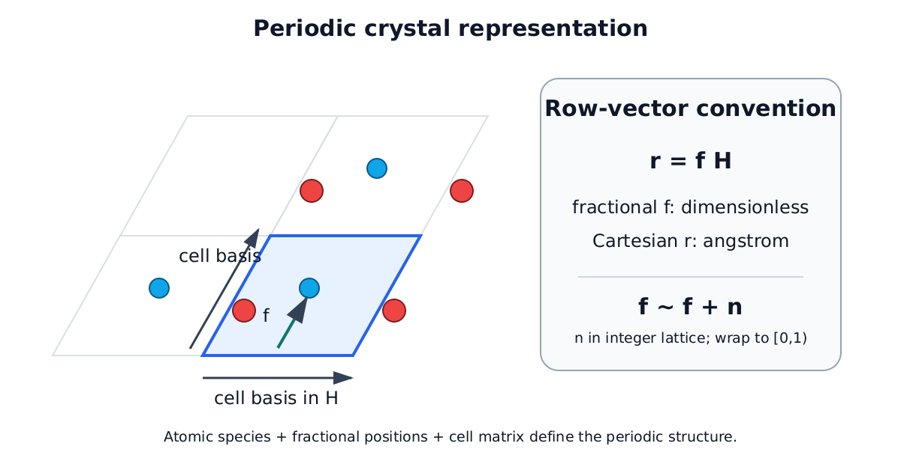
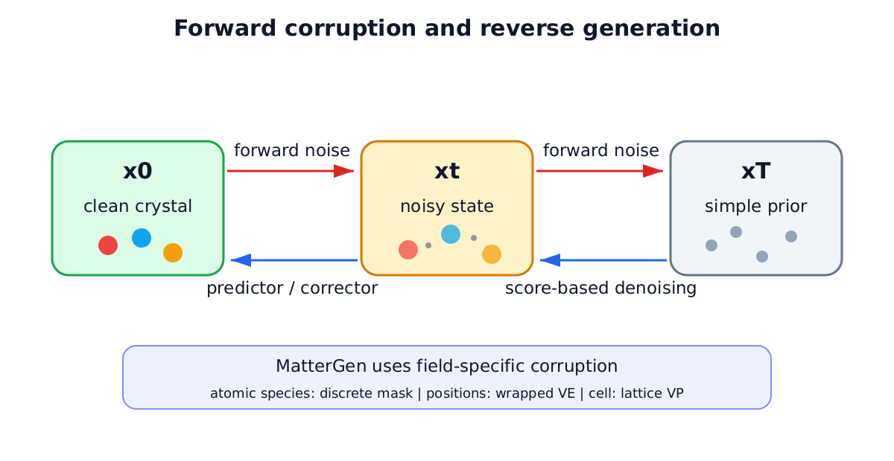
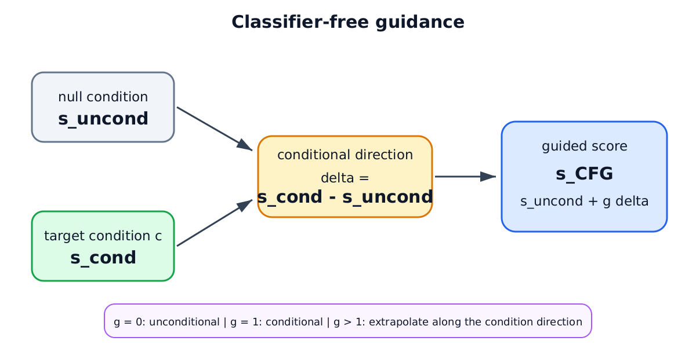
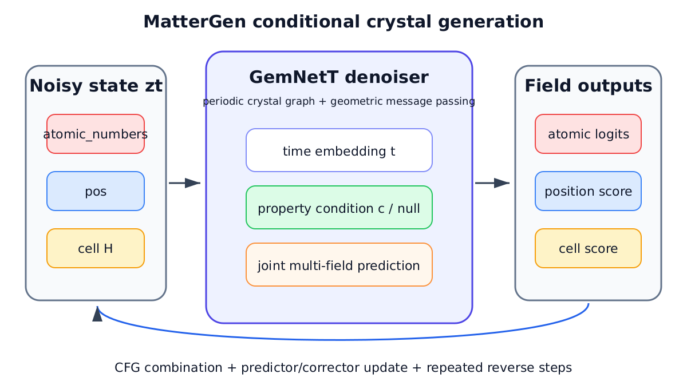
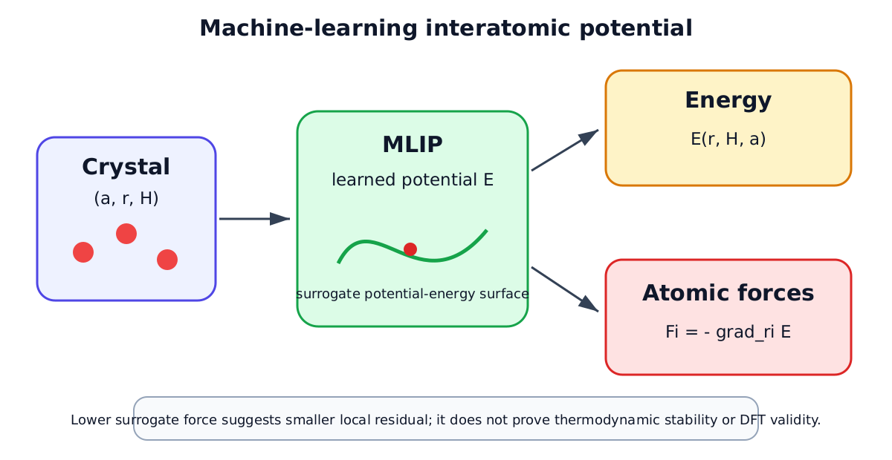

# 第2章 相关理论与关键技术

本章围绕第3章和第4章实际使用的理论与技术建立统一基础。首先说明材料逆向设计中的晶体生成任务及其周期表示；随后介绍扩散生成、时间相关 score、预测干净结构和分类器无关引导；在此基础上说明 MatterGen 的三字段联合生成框架；最后给出神经网络原子间势、MatterSim、CHGNet 以及本文评价指标与配对统计的定义。MatterGen 是本文采用的基础生成模型，而不是本文提出的模型；本文的研究对象是在冻结 MatterGen 权重基础上的推理阶段条件引导与后期神经力场反馈。还需预先强调，本文未将密度泛函理论（density functional theory，DFT）作为正式实验评价环节，后续物理与属性结果主要来自冻结的机器学习代理模型，即 `DFT_VERIFIED=false`。

## 2.1 材料逆向设计与晶体生成问题

材料性质预测通常研究“结构到性质”的正向映射：给定元素组成、原子排布和晶胞，预测能量、力、磁性或力学性质。材料逆向设计则从目标约束出发，寻找可能满足约束的候选晶体，即从“目标性质”反推“候选结构”。正向问题在一个给定结构上产生性质估计，逆向问题却往往对应多个可能解；不同组成和几何结构可能具有相近性质，同一结构的性质还会受计算层级、磁序和松弛状态影响。因此，逆向设计不是对正向模型的简单代数求逆，而是在巨大结构空间中进行受约束生成与筛选。

晶体生成空间同时包含离散变量和连续变量。原子种类属于离散类别；周期分数坐标和晶胞参数属于连续变量；原子数、元素组合及其计量比又产生组合复杂性。与此同时，晶体必须满足周期边界，等价晶胞或整数晶格平移可以表示同一个无限周期结构。生成模型因而不仅要给出“有哪些元素”，还要联合给出“原子位于晶胞中的何处”和“晶胞本身是什么形状与尺度”。在属性条件存在时，模型还需使所生成分布向目标性质偏移，同时避免几何无效、代理能量过高或局部受力过大。

本文将一个含 \(N\) 个原子的晶体写为

$$
\mathcal C=(a,f,H),
\tag{2-1}
$$

其中，\(a\) 表示原子种类，\(f\in[0,1)^{N\times3}\) 表示分数坐标，\(H\in\mathbb R^{3\times3}\) 表示晶胞矩阵。它们分别对应代码中的 `atomic_numbers`、`pos` 和 `cell`。后续章节分别从两个方面改进冻结生成过程：第3章研究属性条件引导，第4章研究生成后期的代理原子力反馈。两者都建立在上述离散—连续耦合表示上。

## 2.2 晶体结构表示与周期性

### 2.2.1 晶体基本表示

有限分子可以直接用一组笛卡尔坐标描述，而理想晶体通过晶胞在三维空间中的平移重复表示。晶胞矩阵 \(H\) 的三行按照本文实现约定存放三个晶格基向量，原子种类 \(a_i\) 和分数坐标 \(f_i\) 则描述第 \(i\) 个晶胞内原子。分数坐标是相对于晶格基的无量纲系数；在本文统一采用的行向量约定下，分数坐标到笛卡尔坐标的关系为

$$
r_i=f_iH,
\tag{2-2}
$$

其中 \(r_i\in\mathbb R^3\) 的单位为 Å。反向变换为 \(f_i=r_iH^{-1}\)，因此有效晶胞至少要求 \(H\) 非奇异。该行向量关系与第4章及冻结实现中 `scaled_positions`、ASE `cell.array` 的用法一致；不能将采用列向量约定的教科书公式直接照搬而遗漏转置。

**表2-1 本文主要符号**

| 符号 | 含义 | 使用说明 |
|---|---|---|
| \(x_t\) | 时间 \(t\) 的含噪扩散状态 | 通用扩散概念 |
| \(x_0\) | 干净结构或扩散终态 | 与预测量区分 |
| \(\hat{x}_0(x_t,t)\) | 从当前状态恢复的预测干净结构 | 三字段分别解析 |
| \(z_t\) | MatterGen 完整采样器状态 | 包含原子、位置、晶胞等内部状态 |
| \(a_t,p_t,H_t\) | 原子种类、位置、晶胞字段 | 对应 `atomic_numbers`、`pos`、`cell` |
| \(f_t\) | 位置字段在时刻 \(t\) 的分数坐标状态 | 第4章进行笛卡尔—分数坐标映射时使用 |
| \(r_i,F_i\) | 第 \(i\) 个原子的笛卡尔坐标与力 | \(r_i=f_iH\)，\(F_i\) 单位为 eV/Å |
| \(s_{\mathrm{cond}},s_{\mathrm{uncond}}\) | 条件与无条件得分 | CFG 的两个预测分量 |
| \(g\) | CFG 强度 | 全文统一的引导强度符号 |
| \(\Delta_a,\Delta_p,\Delta_H\) | 三字段条件—无条件得分残差 | 分别对应原子、位置、晶胞字段 |

### 2.2.2 晶胞、分数坐标与周期邻域

晶胞体积为 \(V=|\det H|\)。改变 \(H\) 会同时改变晶体的尺度、夹角、体积以及分数位移对应的实际笛卡尔距离。因此，位置字段和晶胞字段虽然可以采用不同的扩散过程，却不能在反向生成时被理解为彼此无关。MatterGen 的几何网络在当前晶胞下构造周期邻域，使跨越晶胞边界但在真实空间相邻的原子仍能交换信息[1]。

分数坐标的周期等价关系为

$$
f_i\sim f_i+n,\qquad n\in\mathbb Z^3.
\tag{2-3}
$$

因此，将分数坐标逐分量映射回 \([0,1)\) 的 wrap 操作不会改变其表示的无限周期位置。计算原子间距时也不能只用同一晶胞内的坐标差，而应考虑整数晶格平移。常用的最小镜像分数位移可写为

$$
\Delta f_{ij}^{\mathrm{mic}}
=\Delta f_{ij}-\operatorname{round}(\Delta f_{ij}),
\qquad
\Delta r_{ij}^{\mathrm{mic}}=\Delta f_{ij}^{\mathrm{mic}}H,
\tag{2-4}
$$

其中 \(\Delta f_{ij}=f_j-f_i\)。对一般非正交晶胞，实际实现由周期邻域或结构库完成完整搜索，式（2-4）主要用于说明周期等价和坐标映射的基本思想，而不是替代所有晶胞几何算法。

### 2.2.3 结构等价性与本文所需边界

同一无限晶体可能由不同原子排序、整体整数平移或等价晶胞表示。本文的 Unique 与 Novel 因而依赖周期结构匹配器，而不是逐元素比较原始坐标数组。相反，第3章的“精确参考轨迹”比较的是同一实现、同一状态和同一随机数历史下的采样结果，需要原子字段、位置字段和晶胞字段精确复现；这是一种计算可复现性检查，不等同于宽容差的晶体学结构等价判断。

图2-1给出本文行向量坐标约定及周期复制关系。周期性说明了第4章为何需要先将笛卡尔原子力形成的位移映射为分数坐标修正，再执行 wrap，而不能直接把带 Å 单位的位移加到无量纲位置状态上。

## 2.3 扩散生成模型基础

### 2.3.1 前向扩散过程

扩散模型通过一个预先规定、逐步增加噪声的前向过程，把复杂数据分布变换为易采样的先验分布；神经网络学习其反向去噪过程，从先验噪声逐步恢复样本[2]。以欧氏连续变量上的离散 DDPM 为直观示例，单步前向转移可写为

$$
q(x_t\mid x_{t-1})
=\mathcal N\!\left(x_t;\sqrt{1-\beta_t}\,x_{t-1},\beta_t I\right),
\tag{2-5}
$$

其中 \(\beta_t\) 是第 \(t\) 步噪声强度。记 \(\alpha_t=1-\beta_t\)、\(\bar\alpha_t=\prod_{j=1}^{t}\alpha_j\)，则可以直接从干净样本得到任意时刻状态：

$$
q(x_t\mid x_0)
=\mathcal N\!\left(x_t;\sqrt{\bar\alpha_t}\,x_0,(1-\bar\alpha_t)I\right).
\tag{2-6}
$$

式（2-5）和式（2-6）用于建立扩散直觉，并不意味着 MatterGen 是对三个字段统一施加高斯噪声的普通 DDPM。MatterGen 根据字段几何选择不同 corruption：原子种类采用带 [MASK] 吸收态的离散扩散，周期分数坐标采用 wrapped-normal 的方差爆炸过程，晶胞采用具有原子数相关极限均值和方差的方差保持过程[1]。三字段的前向转移可以条件独立地定义，但反向网络通过共享晶体图联合预测，它们在生成语义上仍然耦合。

### 2.3.2 反向生成过程

反向模型用参数化转移 \(p_\theta(x_{t-1}\mid x_t)\) 逐步去除噪声：

$$
p_\theta(x_{0:T-1}\mid x_T)
=\prod_{t=1}^{T}p_\theta(x_{t-1}\mid x_t),
\qquad x_T\sim p_T.
\tag{2-7}
$$

采样从先验状态开始，经多个时间步得到 \(x_0\)。在连续时间表示中，正向过程可写成随机微分方程；对应的反向时间随机微分方程由漂移项、扩散系数和时间相关 score 共同决定[3]。数值求解时，predictor 负责沿离散化的反向动力学推进，corrector 可在当前噪声尺度上进一步校正样本。本文只在后续方法需要时区分 predictor 与 corrector，不修改其一般数值理论。

### 2.3.3 Score-based 建模

对时间 \(t\) 的扰动分布 \(p_t(x_t)\)，score 定义为其对数密度关于状态的梯度。时间相关网络的目标可概括为

$$
s_\theta(x_t,t)\approx\nabla_{x_t}\log p_t(x_t).
\tag{2-8}
$$

score 指向局部对数密度增大的方向，但它不是材料势能的负梯度，也不是原子力。Score-SDE 的反向过程可写为

$$
\mathrm d x
=\left[b(x,t)-\sigma^2(t)\nabla_x\log p_t(x)\right]\mathrm dt
+\sigma(t)\mathrm d\bar W_t,
\tag{2-9}
$$

其中 \(b(x,t)\) 和 \(\sigma(t)\) 分别表示正向过程的漂移与扩散系数，\(\bar W_t\) 表示反向时间的 Wiener 过程[3]。神经网络用式（2-8）的估计替代未知的真实 score。后文中的条件得分、无条件得分以及位置得分修正都属于生成分布层面的量；第4章的神经势原子力则来自另一套能量模型，两者只有经过明确坐标变换和采样器系数换算后才能组合。

### 2.3.4 预测干净结构

给定含噪状态 \(x_t\) 和模型输出，可以构造模型当前认为的干净结构估计 \(\hat{x}_0(x_t,t)\)，本文称为“预测干净结构”（predicted clean structure）。它不是已经完成采样的 \(x_0\)，也不必等于最终结构；其作用是把当前噪声状态转换为一个可由晶体评价器读取的暂态结构估计。

MatterGen 的三个字段采用不同 corruption，因而不存在一个可无条件替换实际实现的通用 \(\hat{x}_0\) 公式。按照第4章所用冻结代码，设模型对三字段的输出分别为 \(s_t^a,s_t^f,s_t^H\)，离散原子类别偏移为 \(o_a\)，位置边缘标准差为 \(\sigma_f(t)\)，晶胞均值系数与标准差为 \(\alpha_H(t),\sigma_H(t)\)，晶胞极限均值为 \(M_\infty\)，则分别恢复为

$$
\hat a_{0,i}=\arg\max_k s_t^a(i,k)+o_a,
\tag{2-10}
$$

$$
\hat f_0=\operatorname{wrap}\!\left(f_t+\sigma_f^2(t)s_t^f\right),
\tag{2-11}
$$

$$
\hat H_0=
\frac{H_t+\sigma_H^2(t)s_t^H-[1-\alpha_H(t)]M_\infty}
{\alpha_H(t)}.
\tag{2-12}
$$

三者共同构成可评价的 \((\hat a_0,\hat f_0,\hat H_0)\)。第4章正是先从后期状态构造该预测干净结构，再调用 MatterSim 计算代理原子力；它不会把三个估计直接覆盖当前采样状态。

## 2.4 条件扩散与分类器无关引导

### 2.4.1 条件生成

无条件扩散学习总体晶体分布，条件扩散则学习给定条件 \(c\) 时的分布。条件可以是化学体系、空间群或标量性质，网络相应估计

$$
s_\theta(x_t,t,c)\approx\nabla_{x_t}\log p_t(x_t\mid c).
\tag{2-13}
$$

MatterGen 先预训练基础 score 网络，再通过条件适配模块利用带标签数据进行微调，使模型能够接收性质嵌入[1]。本文实验使用 `dft_mag_density` 作为一个具体条件实例，但这不表示 MatterGen 只能处理磁性密度；其原始框架还支持化学、对称性及其他标量性质条件。

### 2.4.2 分类器无关引导

分类器无关引导（classifier-free guidance，CFG）通过同一生成网络的条件预测和空条件预测构造引导得分，不需要额外分类器[4]。本文统一使用

$$
s_{\mathrm{CFG}}(x_t,t,c)
=s_{\mathrm{uncond}}(x_t,t)
+g\left[s_{\mathrm{cond}}(x_t,t,c)-s_{\mathrm{uncond}}(x_t,t)\right],
\tag{2-14}
$$

其中 \(g\) 为 CFG 强度。当 \(g=0\) 时得到无条件预测，\(g=1\) 时得到条件预测；\(g>1\) 沿条件相对无条件的方向作外推，从而强化条件作用。强化条件方向通常会改变条件符合度与样本分布覆盖或生成质量之间的权衡，其影响依赖模型、样本、字段和噪声阶段，不能仅由式（2-14）推断某个更大的 \(g\) 必然更优。

### 2.4.3 条件—无条件预测差异

式（2-14）的核心差异项可按 MatterGen 字段写为

$$
\Delta_a=s_{\mathrm{cond},a}-s_{\mathrm{uncond},a},\qquad
\Delta_p=s_{\mathrm{cond},p}-s_{\mathrm{uncond},p},\qquad
\Delta_H=s_{\mathrm{cond},H}-s_{\mathrm{uncond},H}.
\tag{2-15}
$$

这些差异描述条件信息如何改变当前三字段预测，为第3章的多字段残差分析提供直接理论来源。需要区分“存在条件影响”和“该影响可被可靠控制”：残差的大小可以用作描述量，却不自动等价于终点属性收益、结构质量或安全动作。它能否作为样本级、阶段级在线控制信号，必须由独立实验检验。

标准 CFG 常在整个采样过程中使用预设强度。第3章在此基础上研究引导强度在样本、阶段和字段维度上的优化空间，并进一步讨论共享前缀、候选分支和精确参考轨迹。共享前缀的可比性依赖在分支点同时保存完整 \(z_t\) 与随机数生成器状态；它属于采样状态管理，而不是 CFG 公式本身的性质。本章只提供条件引导基础，不提前给出第3章的方法效果。

## 2.5 MatterGen 晶体生成模型

### 2.5.1 总体框架

MatterGen 是面向无机晶体逆向设计的扩散生成模型，生成过程从随机先验状态出发，逐步联合细化原子种类、周期坐标和晶胞；条件适配模块使其能够按目标化学、对称性或标量性质生成候选结构[1]。原论文针对晶体周期性和字段几何分别设计 corruption，而不是把晶体简单栅格化为图像。本文直接采用其模型与 checkpoint 作为基础生成器，研究重点是冻结权重后的推理阶段方法。

### 2.5.2 三字段联合生成

**表2-2 MatterGen 三类生成字段**

| 规范名称 | 代码字段 | 数据性质 | 前向 corruption 与网络输出要点 |
|---|---|---|---|
| 原子种类字段 | `atomic_numbers` | 离散类别 | 带 [MASK] 吸收态的离散扩散；输出干净原子类别的 logits |
| 位置字段 | `pos` | 周期分数坐标 | wrapped-normal 方差爆炸扩散；输出与周期坐标去噪相关的 score |
| 晶胞字段 | `cell` | 连续 \(3\times3\) 矩阵 | 原子数相关极限分布的方差保持扩散；输出晶胞 score |

三字段的前向 corruption 形式不同，却由同一个几何网络基于当前完整晶体联合预测。原子类型会影响局部化学环境，位置决定邻接距离和方向，晶胞又规定周期映射与空间尺度。因此，“分别输出”不等于“三个独立模型”。第3章可对三个字段分别设置 \(g_a,g_p,g_H\)，是因为代码输出保留字段边界；字段解耦引导改变的是条件与无条件输出的组合系数，不改变基础网络的联合建模事实。

### 2.5.3 GemNetT 去噪网络

本项目配置中的核心去噪器为 `GemNetTDenoiser`，其几何主干为 `GemNetT`。GemNet 属于利用方向信息和多体几何关系的消息传递图神经网络[5]；MatterGen 在此基础上使用适配的 GemNet-dT 结构，对周期晶体图中的局部环境进行建模，并输出原子类别、位置和晶胞相关预测[1]。本地冻结配置与论文描述一致：模型通过当前分数坐标和晶胞即时构建周期邻域；位置头先产生笛卡尔等变输出，再依据当前晶胞转换为分数坐标 score；晶胞头输出与晶胞更新有关的张量；原子头输出类别 logits。

这类网络需要满足与任务相符的几何性质：整体平移不应改变晶体语义，旋转晶体时向量输出应相应旋转，原子重新排序不应改变结构级结果。周期邻域还使位于相邻晶胞镜像中的近邻参与消息传递。上述设计解释了为什么 MatterGen 能够在一个网络中耦合化学与几何字段，也解释了第4章只修改位置 predictor 时仍需保留原子和晶胞预测。

### 2.5.4 条件属性控制与采样

MatterGen 的适配模块把条件嵌入注入几何网络的消息传递层，微调后同一网络可通过真实条件嵌入给出 \(s_{\mathrm{cond}}\)，通过空条件嵌入给出 \(s_{\mathrm{uncond}}\)[1]。采样器再按式（2-14）组合输出。由于三个字段具有不同张量形状和数值尺度，字段残差必须先在各自空间中定义，不能直接拼接后把单一范数解释为统一物理量。

本文后续将固定 CFG 强度 \(g=2.0\) 的 MatterGen 参考基线记为 C0。该命名只用于统一第3章的比较口径，不改变 MatterGen 是本文基础模型而非原创模型的定位。

从论文结构上看，MatterGen 提供了共同技术底座：第3章改变三字段 CFG 的推理时组织方式，第4章在经诊断选定的后期 predictor 事件中向位置 score 增加外部反馈。二者都不重新训练 MatterGen 主干，也不能被表述为“本文提出 MatterGen”。

## 2.6 神经网络原子间势与原子力

### 2.6.1 势能面与局部结构

对原子种类 \(a\)、笛卡尔坐标 \(r\) 和晶胞 \(H\)，原子体系可对应一个势能函数 \(E(r,H,a)\)。在给定晶胞和电子结构近似下，第 \(i\) 个原子的力满足

$$
F_i=-\nabla_{r_i}E(r,H,a).
\tag{2-16}
$$

力是能量对局部坐标变化的负梯度，描述在当前势能面上降低能量的瞬时方向。结构松弛通常迭代更新原子位置及必要的晶胞自由度，直到力或应力满足停止条件。生成结构的较大原子力说明至少部分原子在所用势能面上偏离局部平衡；较小原子力则表示该代理势下的局部一阶残差较小，但不能单独推出全局最低能、热力学稳定或实验可合成。

必须区分几个常被混用的概念。原子力是局部能量梯度；形成能比较化合物与元素参考态的能量；E-hull 比较同一化学组成相对于竞争相凸包的能量距离；热力学稳定性涉及竞争相及给定热力学条件；局部结构松弛只寻找邻近势阱中的较低能构型。第4章关注 MaxF、Mean Force 和松弛 RMSD 所描述的代理局部结构一致性，不把它们等同于 E-hull 或真实热力学稳定性。

### 2.6.2 力相关指标

对含 \(N\) 个原子的结构，本文使用

$$
\operatorname{MaxF}(\mathcal C)=\max_i\lVert F_i\rVert_2,
\qquad
\operatorname{MeanF}(\mathcal C)=\frac{1}{N}\sum_{i=1}^{N}\lVert F_i\rVert_2.
\tag{2-17}
$$

两者单位均为 eV/Å。Mean Force 是“各原子力范数的均值”，不是合力均值的范数；周期体系总力可能因平移对称性接近零，却仍存在较大的成对局部受力。MaxF 对最差局部环境敏感，Mean Force 则概括整体受力水平。

### 2.6.3 神经网络原子间势

DFT 可从电子结构近似出发计算能量、力和应力，但大量生成样本、反复松弛或在线逐步调用的计算成本较高。机器学习原子间势（machine-learning interatomic potential，MLIP）通过第一性原理数据学习从结构到能量、力和应力的映射，以较低推理成本近似目标计算层级，适用于候选筛选、结构松弛和生成过程反馈。

MLIP 的输出仍受训练数据覆盖、模型结构和参考计算设置限制。在分布外结构、异常短键或未覆盖化学环境上，预测误差可能增大；不同 MLIP 即使整体精度良好，也可能对同一结构给出不同力排序。因此，本文把 MLIP 结果称为代理评价，不将其写为 DFT 或实验真值。RC-NFGD 使用的“神经力场”特指 MLIP 给出的能量梯度力反馈。

## 2.7 MatterSim 与 CHGNet

### 2.7.1 MatterSim

MatterSim 是利用大规模第一性原理数据训练的深度学习原子模型，可原生预测能量、原子力和应力，并面向广元素、温度和压力范围的原子模拟[6]。在本文冻结流程中使用 MatterSim-5M checkpoint，但不据此假设它对任意生成中间态都同样可靠。第4章先利用预测干净结构进行阶段诊断，只在后期窗口把 MatterSim 力作为位置反馈。

MatterSim 在本文有两种角色：一是 RC-NFGD 的在线神经力场引导器，二是终态能量、力和松弛相关指标的代理评价器。两种角色使用同一模型会带来同源代理评价风险：方法可能更容易改善提供反馈的势函数，而这种改善未必在另一势或 DFT 上等幅保持。因此，第4章还使用未参与在线引导的 CHGNet 检查跨代理方向。

### 2.7.2 CHGNet

CHGNet 全称为 Crystal Hamiltonian Graph Neural Network，是一种结合晶体图表示与磁矩信息训练的神经网络原子间势，可预测能量、力、应力和磁矩等量[7]。本文一方面使用冻结 CHGNet 输出构造目标磁性密度代理属性误差，另一方面用其力预测对 RC-NFGD 终态进行独立代理评估。

“独立代理评估器”仅表示 CHGNet 不参与 RC-NFGD 的在线力反馈，并不表示它是 DFT 真值；其训练数据也未被视为与其他模型完全独立。CHGNet 与 MatterSim 的跨势方向一致性能够降低单一评价器自洽的疑虑，却不能替代 DFT、实验合成、声子或长时间分子动力学验证。

### 2.7.3 本文中的角色区别

**表2-3 MatterSim 与 CHGNet 在本文中的角色**

| 模型 | 主要输入/输出 | 本文作用 | 是否参与 RC-NFGD 在线生成 | 证据边界 |
|---|---|---|---:|---|
| MatterSim | 晶体结构→能量、力、应力 | 神经力场引导；同源代理评价 | 是 | 不是 DFT，存在同源评价风险 |
| CHGNet | 晶体结构→能量、力、应力、磁矩 | 属性代理；独立代理评估器 | 否 | 独立性仅相对在线引导，不是真值验证 |

这一角色区分贯穿第3—5章：Property MAE、E-hull、Stable、MaxF 等名称必须同时说明实际代理来源；不能因为模型以 DFT 数据训练，就把本论文的代理推理结果称为“DFT 验证”。

## 2.8 评价指标与统计分析

### 2.8.1 属性误差

设第 \(i\) 个样本的冻结属性代理预测为 \(\hat c_i\)，目标条件为 \(c_i^\star\)，本文的 Property MAE 为

$$
E_{\mathrm{prop}}
=\frac{1}{n}\sum_{i=1}^{n}\left|\hat c_i-c_i^\star\right|.
\tag{2-18}
$$

该值越低，表示在所用属性代理模型下，生成结果与目标条件的平均绝对偏差越小。它不是相对于真实实验标签重新测得的通用模型 MAE。不同实验可以设置不同目标值；`dft_mag_density` 是本文的条件实例，具体目标和代理 checkpoint 以相应冻结协议为准。

### 2.8.2 稳定性、有效性与分布指标

E-hull（energy above convex hull）描述候选能量相对同一组成竞争相凸包的距离。按本文评价器的每原子口径，可概括为

$$
h(\mathcal C)
=E_{\mathrm{sur}}(\mathcal C)/N-E_{\mathrm{hull}}(\operatorname{comp}(\mathcal C)),
\tag{2-19}
$$

其中 \(E_{\mathrm{sur}}\) 是冻结代理能量，参考凸包由相应参考数据构建。本文报告的是 surrogate-based E-hull，而不是本论文新执行的 DFT E-hull。冻结评价器把

$$
s(\mathcal C)=\mathbb I[h(\mathcal C)\leq0.1\ \mathrm{eV/atom}]
\tag{2-20}
$$

定义为 Stable。该二值规则表示候选是否落在代理凸包上方 0.1 eV/atom 阈值内；它不等同于有限温度热力学稳定、动力学稳定或可合成性。

Validity 按冻结确认管线的实际实现解释。首先，结构需非空，晶胞有限且体积（行列式）大于 0.1 Å\(^3\)，最小周期原子间距不小于 0.5 Å；随后还需成功转换为结构对象，得到有限属性预测，并完成冻结质量评价。第3章确认代码中的 `evaluation_valid` 是结构/属性可评价与质量评价成功的合取。MatterGen 官方评价器另有基于 SMACT 的 composition validity 指标；除非章节明确报告该指标，本文的 Validity 不自动等同于 SMACT 组成有效性。

Novel 表示结构匹配器在冻结参考数据集中找不到等价结构；Unique 表示在当前生成集合的每个结构等价类中计入一个代表。两者都依赖周期结构匹配规则，不是字符串或坐标精确相等。NUS 在本文实现中是 Novel、Unique 与 Stable 的交集：

$$
\operatorname{NUS}(\mathcal C)
=\mathbb I[\operatorname{Novel}(\mathcal C)]
\mathbb I[\operatorname{Unique}(\mathcal C)]
s(\mathcal C).
\tag{2-21}
$$

NUS 是集合级候选质量指标，不应被写成逐样本层面的真实物理安全证明。

### 2.8.3 原子力与结构偏移指标

MaxF 与 Mean Force 已由式（2-17）定义，数值越低表示所用 MLIP 势面上的最大或平均局部受力更小。本文 RMSD 的参照对象是同一候选的生成前结构与代理势松弛后结构。评价器在周期结构匹配、原子对应和必要的结构预处理后，以 Å 为单位计算原子位移的均方根：

$$
\operatorname{RMSD}
=\sqrt{\frac{1}{N}\sum_{i=1}^{N}\lVert r_i^{\mathrm{relaxed}}-r_i^{\mathrm{generated}}\rVert_2^2}.
\tag{2-22}
$$

式（2-22）表达其物理含义；真实实现还处理周期镜像、晶胞匹配和原子对齐，不能用未经匹配的原始数组差替代。较小 RMSD 表示在当前代理松弛协议下所需几何调整较小，但仍不是 DFT 局部极小或真实热力学结论的充分条件。

**表2-4 本文主要评价指标**

| 指标 | 冻结口径 | 有利方向 | 主要边界 |
|---|---|---:|---|
| Property MAE | 代理属性与目标条件的平均绝对误差 | 低 | 依赖属性代理 |
| E-hull | 代理每原子能量相对参考凸包 | 低 | 非本论文 DFT E-hull |
| Stable | E-hull不高于0.1 eV/atom 的比例 | 高 | 代理阈值判断 |
| Validity | 几何、有限预测与完整评价成功 | 高 | 不自动等同 SMACT 组成有效性 |
| Novel | 未匹配冻结参考数据 | 高 | 依赖参考集和匹配器 |
| Unique | 生成集合内每个结构等价类计一个代表 | 高 | 依赖集合规模和匹配器 |
| NUS | Novel、Unique 且 Stable | 高 | 三者交集，非真实可合成率 |
| MaxF | \(\max_i\lVert F_i\rVert_2\) | 低 | 代理势局部受力 |
| Mean Force | \(N^{-1}\sum_i\lVert F_i\rVert_2\) | 低 | 不是平均力向量的范数 |
| RMSD | 生成结构与代理松弛结构的匹配位移 | 低 | 依赖代理松弛与匹配协议 |

### 2.8.4 配对统计与 Bootstrap

第3章和第4章的核心比较采用匹配种子设计：基线与候选方法从同一随机 seed 启动，使每对结果共享初始随机因素。设第 \(i\) 对在某个“越低越好”指标上的基线值和方法值分别为 \(m_i^{C0}\) 与 \(m_i^{\mathrm{method}}\)，定义有利配对差为

$$
d_i=m_i^{C0}-m_i^{\mathrm{method}}.
\tag{2-23}
$$

\(d_i>0\) 表示方法改善，\(d_i=0\) 表示持平，\(d_i<0\) 表示损害。对于 Stable、Validity 等“越高越好”指标，应反转差值方向或直接按更高者为 Win，不能机械沿用式（2-23）。W/T/L 分别统计配对 Win、Tie 与 Loss，并与均值效应共同揭示收益是否由少数极端样本驱动。

配对自助法（paired bootstrap）每次以“样本对”为单位有放回重采样，保留对内对应关系，再计算均值差或相对变化。本文第3章和第4章的确认性核心连续指标使用 20 000 次确定性配对重采样，并报告 95% 区间；探索性或辅助分析若采用不同次数，则以对应实验协议为准。Bootstrap 区间衡量当前 cohort 下统计量的不确定性，不消除代理模型偏差，也不把有限任务上的结果自动提升为跨材料域结论。

伤害率和尾部分析与均值互补。伤害率统计逐样本不利变化的比例；分位数、经验累积分布或高风险阈值用于检查均值改善是否伴随尾部恶化。因而后续章节按照“主效应—配对区间—W/T/L—护栏—尾部—证据边界”的顺序解释结果，而不只比较两个均值。

## 2.9 本章小结

本章给出了后续方法所需的统一技术基础。晶体由原子种类、周期分数坐标和晶胞共同表示，本文采用行向量约定 \(r_i=f_iH\)，并通过 wrap、周期邻域和结构匹配处理周期等价。扩散模型从前向 corruption 出发学习反向生成，score 表示时间相关扰动分布的对数密度梯度；MatterGen 对三个字段使用不同扩散形式，因此预测干净结构也需分别解析。

条件扩散通过性质条件改变生成分布，CFG 将条件与无条件得分按统一强度组合。MatterGen 以适配的 GemNetT 几何网络联合去噪 `atomic_numbers`、`pos` 和 `cell`，构成本文两项推理阶段研究的基础模型。神经网络原子间势提供能量、力和应力的低成本代理；MatterSim 在本文同时承担 RC-NFGD 引导与同源代理评价，CHGNet 则承担属性代理和未参与在线力反馈的独立代理评估。二者都不构成 DFT 真值。

最后，本章统一定义了 Property MAE、E-hull、Stable、Validity、Novel、Unique、NUS、MaxF、Mean Force、RMSD、配对自助法与 W/T/L，并明确区分代理局部结构一致性与热力学稳定性。在上述理论基础上，第3章首先围绕 MatterGen 的条件引导机制研究目标属性生成精度的优化问题。

## 本章参考文献（并入论文总参考文献时统一编号）

[1] Zeni C, Pinsler R, Zügner D, et al. A generative model for inorganic materials design[J]. Nature, 2025, 639: 624–632. DOI: 10.1038/s41586-025-08628-5.

[2] Ho J, Jain A, Abbeel P. Denoising Diffusion Probabilistic Models[C]//Advances in Neural Information Processing Systems 33. 2020: 6840–6851.

[3] Song Y, Sohl-Dickstein J, Kingma D P, et al. Score-Based Generative Modeling through Stochastic Differential Equations[C]. International Conference on Learning Representations, 2021. arXiv:2011.13456.

[4] Ho J, Salimans T. Classifier-Free Diffusion Guidance[EB/OL]. arXiv:2207.12598, 2022.

[5] Gasteiger J, Becker F, Günnemann S. GemNet: Universal Directional Graph Neural Networks for Molecules[C]//Advances in Neural Information Processing Systems 34. 2021: 6790–6802.

[6] Yang H, Hu C, Zhou Y, et al. MatterSim: A Deep Learning Atomistic Model Across Elements, Temperatures and Pressures[EB/OL]. arXiv:2405.04967, 2024.

[7] Deng B, Zhong P, Jun K, et al. CHGNet as a pretrained universal neural network potential for charge-informed atomistic modelling[J]. Nature Machine Intelligence, 2023, 5: 1031–1041. DOI: 10.1038/s42256-023-00716-3.
