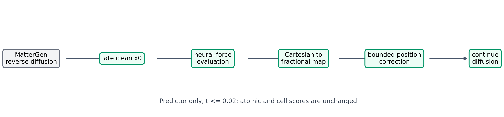
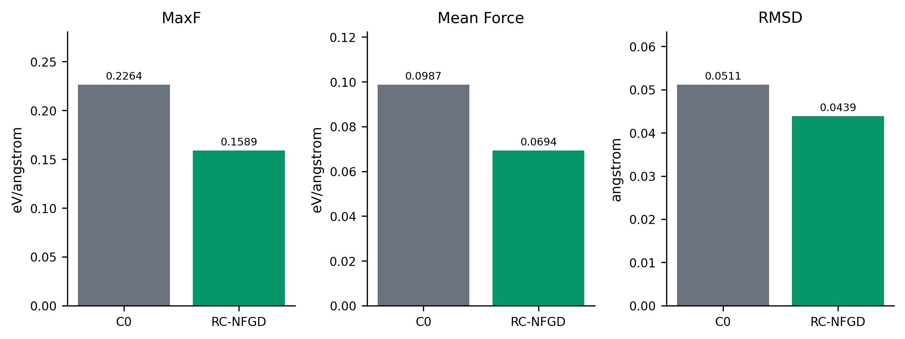
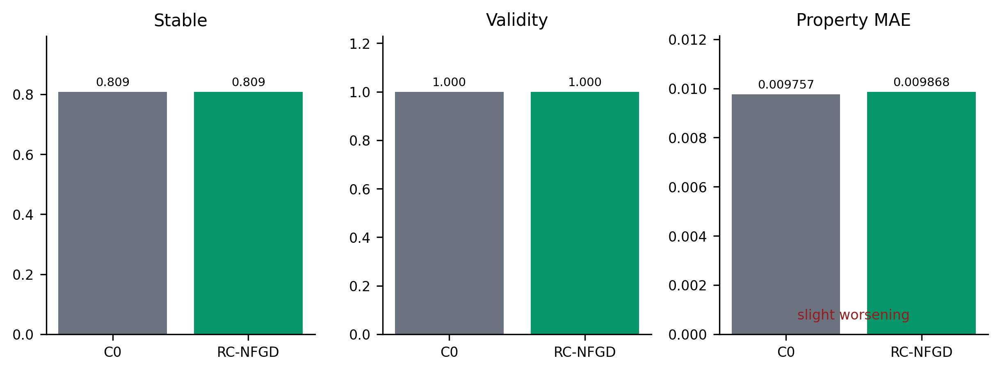

# 第4章 基于阶段可靠性校准的后期神经力场引导扩散方法

MatterGen 通过联合去噪原子类型、周期分数坐标和晶胞，实现无机晶体的条件生成[1]。第3章主要从条件引导角度改善目标属性生成精度，但属性条件满足并不等价于局部结构处于低受力状态。生成模型学习的是训练数据分布及条件属性之间的统计关系，其逆扩散更新并不显式要求当前结构沿局部势能下降方向移动，因此最终结构仍可能出现较大的代理原子力或较长的代理松弛位移。针对这一问题，本章提出基于阶段可靠性校准的后期神经力场引导扩散方法（Reliability-Calibrated Late-stage Neural Force-Guided Diffusion，RC-NFGD）。该方法先通过阶段诊断确定预测干净结构（predicted clean \(x_0\)）可以可靠预示最终受力排序的时间区间，再在逆扩散后期调用 MatterSim 神经势模型，将其给出的笛卡尔原子力变换为有界的周期分数坐标修正，并通过预测器的实际 score 系数注入位置更新。

本章最终结论为 **INNOVATION2_FINAL_STATUS = SUPPORTED**，但这一结论严格限定在冻结模型、配对样本和代理评价协议之内。正式的 256 对样本实验表明，RC-NFGD 将 MatterSim 预测的最大原子力、平均原子力和松弛 RMSD 分别降低 29.81%、29.72% 和 14.17%；CHGNet 独立代理评估器也给出方向一致的均值改善。与此同时，目标 Property MAE 轻微恶化 1.14%，部分 CHGNet 高分位尾部指标没有改善，等预算生成后修正的 MatterSim MaxF 更低。本章没有执行 DFT 计算，故 **DFT_VERIFIED = false**，不能将代理力改善表述为真实势能面或物理稳定性已经得到证明。

## 4.1 问题定义与研究动机

### 4.1.1 条件扩散生成中的局部结构问题

扩散模型通过正向加噪构造易采样的先验分布，再学习反向去噪过程[2]；从连续时间观点看，反向随机微分方程由扰动分布的时间相关 score 决定，并可由预测器—校正器数值求解[3]。MatterGen 将该思想扩展到晶体结构，采样状态可记为

\[
z_t=(a_t,f_t,H_t),
\]

其中 \(a_t\) 表示原子类型字段，\(f_t\in[0,1)^{N\times3}\) 表示周期分数坐标，\(H_t\in\mathbb{R}^{3\times3}\) 表示以行向量为约定的晶胞矩阵。模型输出相应的原子、位置和晶胞预测量。固定 CFG=2.0 的 MatterGen 参考基线记为 C0；在本章中，C0 还固定目标磁性密度为 0.2、扩散步数为 1 000，并在每步执行一次 corrector。

条件生成目标主要约束样本分布与目标属性，并不等价于逐步最小化某一原子势能。对于生成结构 \(\mathcal C=(a,f,H)\)，若神经势给出第 \(i\) 个原子的笛卡尔力 \(F_i\)，本章关注两个预松弛代理指标：

\[
\operatorname{MaxF}(\mathcal C)=\max_i\lVert F_i\rVert_2,
\qquad
\operatorname{MeanF}(\mathcal C)=\frac{1}{N}\sum_{i=1}^{N}\lVert F_i\rVert_2.
\]

较大的代理力说明该结构在所用机器学习势的能量面上偏离局部平衡，但它不是 DFT 力，也不能单独证明结构不稳定或不可合成。常见处理方式是在生成结束后进行结构松弛；本章研究的是另一问题：能否在生成尚未结束时，把外部神经势提供的局部几何反馈直接嵌入逆扩散轨迹，使模型在保持原条件生成过程的同时减少终态代理受力？

### 4.1.2 直接力引导的困难

直接对所有时间步施加力反馈存在两类困难。第一，早期 \(z_t\) 含有较强噪声，原子类型、坐标和晶胞尚未形成一致晶体，神经势在此类状态上的输出缺乏明确解释。第二，MatterSim 返回笛卡尔坐标中的原子力，而 MatterGen 的位置状态是周期分数坐标，且预测器通过 score 项而非直接坐标加法完成更新；若忽略坐标系和更新系数，力方向、位移尺度和周期边界都可能被错误处理。

因此，本章把方法设计分解为三个问题：其一，何时预测干净结构足够可靠；其二，如何把神经势的笛卡尔方向映射到周期位置状态；其三，如何控制单次修正并在异常情况下执行安全回退。RC-NFGD 的核心不是让 MatterSim 取代 MatterGen，而是在经诊断选定的后期窗口内，为原位置预测器增加一个可审计的、仅作用于坐标字段的外部反馈。整体流程如图4-1所示。

### 4.1.3 研究假设与验证原则

本章的核心假设不是“神经势能够在任意噪声阶段提供正确答案”，而是一个范围更窄、可被实验否证的命题：当预测干净结构与最终结构的代理受力已经具有足够高的排序一致性时，沿中心化神经势力方向施加小幅位置反馈，可以在不改动 MatterGen 权重和条件机制的前提下，降低最终结构的代理受力。该假设包含阶段可靠性、方向有效性和质量代价三个部分，分别由阶段诊断、方向消融和正式配对实验检验。

验证过程遵循由小到大的冻结流程。阶段诊断只决定时间窗口和参考尺度；P0 检查可行性与安全护栏；Formal32 检查独立复现；Formal256 承担正式主结论。每一阶段使用新的配对种子，候选通过后才进入下一阶段，并保持采样器、阈值与主指标不变。最终证据同时报告配对胜负、均值效应、20 000 次 bootstrap 区间和质量护栏，而不以单个均值作为充分依据。由于主力评价器参与引导，另用 CHGNet 检查跨势方向；由于在线方法可能并不优于终态修正，再设置等调用预算的生成后修正比较。这样的验证结构使“方法有效”与“方法在所有替代方案中最优”成为两个明确分离的问题。

## 4.2 后期结构可靠性分析

### 4.2.1 诊断协议

神经势模型需要完整晶体作为输入，但当前扩散状态 \(z_t\) 本身包含噪声。为避免直接评价含噪状态 \(x_t\)，本研究从 MatterGen 的当前状态和模型输出解析恢复预测干净结构 \(\widehat z_0(t)\)，并在 32 个冻结诊断种子上保存 \(t=0.10,0.05,0.02,0.01\) 四个非终态时间点及最终参考状态。诊断样本划分为 16 个 calibration seeds 和 16 个 validation seeds；阶段门槛使用预注册的 32 样本整体 Spearman 相关性。每个时间点均调用 MatterSim-5M 计算预测干净结构的 MaxF，再与同一轨迹最终结构的 MaxF 比较。

归档中标为 “requested_t_norm=0.00” 的一行实际上是采样器在 \(\epsilon\) 处、“model_t=0.001” 的最后一次 predictor 之后的状态，并非数学意义上的 \(t=0\) 模型求值。因此，阶段选择明确排除这一终态行，只在 \(t\leq0.05\) 的非终态点中选择。诊断还检查有限值、明显 OOD、最小周期距离和体积范围；160 次阶段评价全部有限且有效，明显 OOD 比例为 0。

### 4.2.2 阶段相关性结果

表4-1给出预测干净结构的 MaxF 与最终 MaxF 的主要诊断结果。\(t=0.02\) 的 Spearman 相关系数达到 0.925587（\(n=32,p=3.422\times10^{-14}\)），为预注册非终态候选中的最高值；此时有限/有效率为 100%，预测干净结构的 MaxF 与最终 MaxF 的中位绝对差为 0.012049 eV/Å。验证子集在该点的 Spearman 相关系数为 0.982353，说明排序一致性并非仅来自 calibration 子集。相比之下，同一时间点的预测干净结构能量/原子与最终 E-hull 的 Spearman 相关系数仅为 0.269428，没有达到 0.30 的辅助支持门槛。本研究据此只把阶段诊断用于“MaxF 信号可用于后期引导”的判断，不把它扩展为能量或稳定性的普遍可靠性结论。

**表4-1 后期预测干净结构的阶段可靠性诊断**

| \(t\) | 样本数 | 有限/有效率 | MaxF–最终MaxF Spearman | \(p\) 值 | MaxF中位绝对差（eV/Å） |
|---:|---:|---:|---:|---:|---:|
| 0.10 | 32 | 100% | 0.812683 | \(1.609\times10^{-8}\) | 0.0376410 |
| 0.05 | 32 | 100% | 0.707845 | \(5.863\times10^{-6}\) | 0.0302772 |
| **0.02** | **32** | **100%** | **0.925587** | **\(3.422\times10^{-14}\)** | **0.0120487** |
| 0.01 | 32 | 100% | 0.912757 | \(3.409\times10^{-13}\) | 0.0125316 |

上述结果支持的命题是：在当前模型、条件和神经势下，后期 \(t\leq0.02\) 的预测干净结构所给 MaxF 与最终 MaxF 具有较强排序一致性。它不意味着早期力一定错误，也不意味着后期力在物理上精确。RC-NFGD 中的“Reliability-Calibrated”正是指引导窗口由这一冻结诊断确定，而不是在正式结果出现后选择有利时间步。

这里选择 Spearman 相关而非只比较阶段均值，是因为引导需要识别哪些轨迹具有更大的局部受力风险。即使阶段 MaxF 与终态 MaxF 存在线性尺度偏差，只要排序稳定，后期信号仍可作为相对风险反馈；反之，阶段均值接近终态但逐样本排序混乱，并不能支持闭环介入。诊断中 \(t=0.02\) 的 Pearson 相关系数也达到 0.984905，但阶段门槛预先指定的是对异常值和非线性尺度更稳健的 Spearman 指标，故正式选择不以后验更有利的 Pearson 结果替代。

此外，\(t=0.10\) 的相关系数已经为正，但其 MaxF 中位绝对差约为 \(t=0.02\) 的三倍；\(t=0.05\) 的排序相关性又低于 0.02。这说明“越接近终点越可靠”在当前有限网格上并非严格单调定律。冻结窗口应理解为诊断得到的任务特定工作区间，而不是关于所有扩散模型的普遍时间规律。后续实验只验证这一选定窗口的总体方法，不再根据 P0 或 Formal 结果重新挑选时间点。

## 4.3 RC-NFGD 方法设计

### 4.3.1 预测干净结构的解析恢复

记 MatterGen 在时间 \(t\) 的三个输出为 \(s_t^a,s_t^f,s_t^H\)。实际代码对三个字段采用不同的预测干净结构估计，而非人为规定一个统一公式。对离散原子类型，取原子类别输出的最大分量，并加上离散 corruption 的类别偏移 \(o_a\)：

\[
\widehat a_{0,i}=\arg\max_k s^a_t(i,k)+o_a.
\]

对周期位置，设位置 SDE 在当前时间的边缘标准差为 \(\sigma_f(t)\)，则实现中的预测干净结构估计为

\[
\widehat f_0=\operatorname{wrap}\!\left(f_t+\sigma_f^2(t)s_t^f\right),
\]

其中 wrap 将分数坐标映射回周期基本单元。对晶胞字段，设 \(\alpha_H(t)\) 和 \(\sigma_H(t)\) 分别为 cell SDE 的均值系数和标准差，\(M_\infty\) 为其极限均值，则

\[
\widehat H_0=
\frac{H_t+\sigma_H^2(t)s_t^H-[1-\alpha_H(t)]M_\infty}
{\alpha_H(t)}.
\]

由 \((\widehat a_0,\widehat f_0,\widehat H_0)\) 构造带周期边界的完整预测干净晶体，供神经势评价。该过程只为计算反馈创建评价结构，并未把三个预测干净结构估计直接替换进采样状态。

### 4.3.2 神经力场原子力估计

本研究使用冻结的 MatterSim-5M 神经势模型（机器学习原子间势，MLIP）作为引导器。机器学习原子间势以晶体结构为输入，近似势能及其导数；在经典关系下，第 \(i\) 个原子的力写为

\[
F_i=-\nabla_{r_i}E_{\mathrm{MS}}(\widehat a_0,\widehat f_0,\widehat H_0),
\]

其中 \(r_i=\widehat f_{0,i}\widehat H_0\) 为笛卡尔坐标，\(E_{\mathrm{MS}}\) 表示 MatterSim 预测能量[4]。工程实现通过 MatterSim inference 接口直接获得 energy 和 forces，并没有在本研究中执行 DFT 梯度计算。为消除整体平移分量，先对力做中心化：

\[
\widetilde F_i=F_i-\frac{1}{N}\sum_{j=1}^{N}F_j.
\]

中心化后所有原子修正之和为零，使反馈关注内部相对几何，而不人为平移整个周期晶胞。

### 4.3.3 周期坐标与力方向映射

MatterSim 力和拟议位移位于笛卡尔坐标系，MatterGen 的位置状态则为分数坐标。按照代码中的行向量约定，笛卡尔坐标与分数坐标满足

\[
r=fH.
\]

因此，在冻结的预测干净晶胞 \(\widehat H_0\) 下，笛卡尔位移 \(\delta r\) 的分数坐标表示为

\[
\delta f=\delta r\widehat H_0^{-1}.
\]

候选位置通过 \(\operatorname{wrap}(\widehat f_0+\delta f)\) 施加周期边界。该映射避免把具有 Å 单位的笛卡尔量直接加到无量纲分数坐标上，也保留非正交晶胞中的几何方向。若预测干净晶胞含非有限值或行列式非正，方法立即执行安全回退，继续使用原始 MatterGen score。

### 4.3.4 有界位置修正与安全回退

设冻结参考力为 \(F_{\mathrm{ref}}=0.0779514922\) eV/Å，名义步长为 \(\eta=0.005\) Å，硬上限为 \(\delta_{\max}=0.01\) Å。实现先计算 \(q=\max_i\lVert\widetilde F_i\rVert_2\)，再得到

\[
\gamma=\frac{\eta}{\max(q,F_{\mathrm{ref}})},
\qquad
\delta r_i^{(0)}=\gamma\widetilde F_i.
\]

若 \(m=\max_i\lVert\delta r_i^{(0)}\rVert_2>\delta_{\max}\)，则统一缩放为

\[
\delta r_i=\frac{\delta_{\max}}{m}\delta r_i^{(0)};
\]

否则 \(\delta r_i=\delta r_i^{(0)}\)。由于当前冻结缩放已经把事件内最大位移限制在不超过名义 0.005 Å，0.01 Å 硬上限在正式运行中没有成为主要约束；P0 和 Formal32 的最大观测修正均为 0.005 Å。故本文将其称为“有界修正”，作用定位为显式步长控制与异常防护，而不是经过实验确认的性能核心。

映射到分数坐标后，算法在预测干净晶体上预演候选位置。只有当最小周期原子间距有限且不小于 0.5 Å 时才接受修正；任何神经势异常、非有限数、无效晶胞、过小 score 系数或距离违规都会触发安全回退，继续使用未修改的 MatterGen score。该规则保证异常反馈不会替换原预测器，但并不构成对真实物理安全性的保证。

### 4.3.5 生成过程中的后期力引导

RC-NFGD 不直接把 \(\delta f\) 加到当前状态，而是利用祖先 predictor 的实际 score 系数实现等价注入。设位置 predictor 在当前步的更新可抽象为

\[
f_{t-\Delta t}=A_t(f_t)+c_t^f s_t^f+\xi_t,
\]

其中 \(A_t\) 汇集不依赖当前位置 score 的确定性项，\(c_t^f\) 是代码通过 predictor coefficient 接口得到的精确 score coefficient，\(\xi_t\) 表示该 predictor 的随机项。算法定义

\[
\Delta s_t^f=\frac{\delta f}{c_t^f},
\qquad
\widetilde s_t^f=s_t^f+\Delta s_t^f.
\]

于是 guided predictor 的 score 贡献为

\[
c_t^f\widetilde s_t^f=c_t^f s_t^f+\delta f,
\]

恰好把期望的分数坐标位移加入本次 predictor 更新。引导只在 predictor 阶段且 \(t\leq0.02\) 时启用；atomic、cell、stress 和 energy guidance 全部关闭，corrector 也保持官方更新。1 000 步采样中实际触发 20 次，对应模型时间 \(0.020,0.019,\ldots,0.001\)。图4-1中的“构造预测干净晶体—评价力—坐标映射—score 注入”即为这一闭环。

**算法4-1 基于阶段可靠性校准的后期神经力场引导扩散（RC-NFGD）**

~~~text
输入：条件 c，初始噪声 z1，MatterGen predictor-corrector，
      MatterSim 力模型，可靠阶段阈值 t_rel=0.02，
      F_ref，η，δ_max，最小周期距离 d_min
输出：最终晶体 z0

1:  初始化 z ← z1；固定 CFG=2.0
2:  for t 从 1 递减至采样器 ε do
3:      计算 MatterGen 条件/无条件输出并组成原始 score s_t
4:      if 当前阶段不是 predictor 或 t > t_rel then
5:          使用原始 s_t 完成官方 predictor/corrector 更新
6:          continue
7:      end if
8:      按各字段真实 SDE 公式恢复 (â0, f̂0, Ĥ0)
9:      用 MatterSim 在该预测干净晶体上计算 E 和笛卡尔力 F
10:     去除 F 的整体平移分量，并按 F_ref、η 和 δ_max 构造 δr
11:     计算 δf ← δr Ĥ0^(-1)，并在周期边界下预演候选结构
12:     if 输出有限、晶胞有效且候选最小周期距离 ≥ d_min then
13:         从 predictor 取得实际位置 score 系数 c_t^f
14:         s_t^f ← s_t^f + δf / c_t^f
15:     else
16:         保留原始 score（安全回退）
17:     end if
18:     完成该步官方 predictor；atomic/cell score 与 corrector 不变
19:  end for
20:  返回最终晶体 z0
~~~

## 4.4 阶段可靠性校准与方法冻结

RC-NFGD 的所有关键量在确认性样本生成前冻结。阶段阈值来自4.2节的诊断；\(F_{\mathrm{ref}}\) 取 calibration seeds 710000–710015 在 \(t=0.02\) 的 MaxF 中位数；位置修正乘子固定为 1.0，没有执行 lambda sweep、时间步 sweep 或位移上限 sweep。表4-2汇总最终配置。

**表4-2 RC-NFGD 冻结配置**

| 配置项 | 冻结值 | 作用 |
|---|---:|---|
| 目标磁性密度 | 0.2 | 条件任务 |
| CFG | 固定 2.0 | 与 C0 保持一致 |
| 扩散步/每步 corrector | 1 000 / 1 | 官方采样预算 |
| 可靠阶段 | predictor 且 \(t\leq0.02\) | 共20次力反馈 |
| 预测干净结构评价 | 开启 | 不在含噪状态 \(x_t\) 上评价力 |
| 引导字段 | position only | atomic/cell/stress/energy 均关闭 |
| \(F_{\mathrm{ref}}\) | 0.0779514922 eV/Å | 低力区尺度基准 |
| 名义步长 \(\eta\) | 0.005 Å | 单事件修正尺度 |
| 硬上限 \(\delta_{\max}\) | 0.01 Å | 防止异常大位移 |
| 最小周期距离 | 0.5 Å | 候选安全检查 |
| 安全回退 | 原始 MatterGen score | 异常时不施加修正 |

图4-1给出流程，阶段诊断则给出“为何从 \(t=0.02\) 开始”的依据。二者共同限定“可靠性校准”的含义：这里的校准是一次性、冻结的阶段选择和尺度确定，不是采样时根据正式结果自适应调参。P0、Formal32 和 Formal256 均沿用同一实现；Formal256 的实现锁记录了源文件哈希，所有注册种子均保留，不因结果好坏替换。

阶段诊断与效果确认在协议上承担不同职责。诊断集合可以用于确定 \(t_{\mathrm{rel}}\) 和 \(F_{\mathrm{ref}}\)，但不能用于估计正式改善；P0、Formal32 与 Formal256 的配对 seed 则不参与这些量的选择。参考力使用 calibration 半集在 \(t=0.02\) 的 MaxF 中位数，主要避免低力样本因直接除以很小的最大力而得到不稳定比例。对 \(q\geq F_{\mathrm{ref}}\) 的事件，事件内最大位移被缩放到 0.005 Å；对 \(q<F_{\mathrm{ref}}\) 的事件，最大位移随受力减小而继续缩小。因此，它兼具高力区归一化和低力区衰减，而不是对每次事件强制施加相同幅度。

复现性还依赖确定性配对设计。每个实验臂从相同 seed 启动，基础模型权重冻结，C0 和 F0 的主网络 score 调用数相同；Formal256 配置、源代码哈希和 256 个种子均在运行前登记。20 次 MatterSim 调用是 RC-NFGD 的组成部分，不包括最终统一评价所需的离线评价调用。这样可以把配对差异主要归因于在线位置反馈，同时保留神经势自身误差、硬件运行波动和不同代理模型之间偏差等不能消除的外部不确定性。

## 4.5 小规模验证与方法冻结

### 4.5.1 P0 可行性验证

P0 使用 16 个全新配对种子比较官方基准 B0 与 RC-NFGD F0。320 次符合条件的力引导全部被接受，安全回退次数为 0。Mean MaxF 从 0.304028 降至 0.253392 eV/Å，相对降低 16.66%，配对胜/平/负为 15/0/1，20 000 次配对 bootstrap 的相对改善 95% CI 为 [10.17%, 31.24%]。平均原子力从 0.148469 降至 0.123007 eV/Å，RMSD 从 0.116299 降至 0.114453 Å。

质量侧没有出现 P0 门槛规定的明显退化：Stable 均为 75.00%，NUS 均为 31.25%，Validity 均为 100%；Property MAE 从 0.009940 略降至 0.009889，E-hull 则增加 0.000809 eV/atom。端到端生成时间比为 0.9998。由于 P0 仅承担先导筛选作用，其 GO 不能替代更大独立 cohort 的确认。

### 4.5.2 Formal32 独立复现

方法在 P0 之后保持不变，并在 32 个新配对种子上进行 Formal32。MaxF 从 0.183472 降至 0.134728 eV/Å，相对降低 26.57%；32 个样本全部改善，20 000 次 bootstrap 的相对改善 CI 为 [14.27%, 52.86%]。平均原子力从 0.073237 降至 0.048879 eV/Å，RMSD 从 0.052132 降至 0.048991 Å，相对约降低 6.03%。Stable、Novel、Unique、NUS 和 Validity 均保持不变；Property MAE 从 0.006128 轻微增至 0.006148，E-hull 增加 0.000180 eV/atom，均在冻结护栏内。F0/C0 端到端运行时间比为 1.00336。

**表4-3 P0 与 Formal32 的效应复现**

| 实验 cohort | \(n\) | C0/B0 MaxF | RC-NFGD MaxF | 相对降低 | 95% CI | W/T/L | 判定 |
|---|---:|---:|---:|---:|---:|---:|---|
| P0 | 16 | 0.304028 | 0.253392 | 16.66% | [10.17%, 31.24%] | 15/0/1 | GO |
| Formal32 | 32 | 0.183472 | 0.134728 | 26.57% | [14.27%, 52.86%] | 32/0/0 | STRONG_CONFIRMED |

P0 与 Formal32 的作用是验证方法可运行且改善方向能在新 cohort 上复现。图4-4将这两个阶段与 Formal256 的效应量并列显示。不同 cohort 的绝对 MaxF 受组成和样本难度影响，不能把三组绝对均值解释为随样本规模单调变化；可比较的是冻结方法在三组新种子上都得到正向相对效应。

## 4.6 Formal256 正式实验

### 4.6.1 实验设计与主结果

Formal256 使用 256 个注册配对种子，C0 与 RC-NFGD 从相同 seed 生成，各方法均完成 256/256，没有丢弃或替换样本。主统计量定义为 cohort 均值的相对降低

\[
R_m=\frac{\overline y_{\mathrm{C0}}-\overline y_{\mathrm{RC}}}
{\overline y_{\mathrm{C0}}},
\]

其中对“越低越好”的连续指标，\(R_m>0\) 表示改善。置信区间由冻结随机种子下 20 000 次配对 bootstrap 获得。表4-4完整报告主力指标与质量护栏，不隐藏不利的属性变化。

**表4-4 Formal256 主结果（相对变化和 CI 均按 C0−RC-NFGD 的有利方向定义）**

| 指标 | C0 | RC-NFGD | 有利相对变化 | 95% CI | W/T/L |
|---|---:|---:|---:|---:|---:|
| MatterSim MaxF（eV/Å） | 0.226408 | 0.158911 | **29.81% 改善** | [21.42%, 40.88%] | 254/0/2 |
| MatterSim Mean Force（eV/Å） | 0.098702 | 0.069373 | **29.72% 改善** | [24.01%, 36.96%] | 255/0/1 |
| RMSD（Å） | 0.051137 | 0.043893 | **14.17% 改善** | [4.54%, 25.95%] | 216/21/19 |
| Property MAE（\(\mu_B/\text{Å}^3\)） | 0.009757 | 0.009868 | **1.14% 恶化** | [−2.46%, −0.22%] | 95/0/161 |
| Stable | 80.86% | 80.86% | 0 | [0, 0] | 0/256/0 |
| Validity | 100% | 100% | 0 | [0, 0] | 0/256/0 |

MaxF 的绝对改善为 0.067497 eV/Å，绝对改善 CI 为 [0.046627, 0.105057] eV/Å，单侧配对胜数检验 \(p=2.84\times10^{-73}\)。Mean Force 的绝对改善为 0.029330 eV/Å，RMSD 的绝对改善为 0.007244 Å。三项相对改善区间均严格大于零，且 MaxF 有 254/256 个配对样本改善，说明主结论并非由少数均值离群点单独驱动。图4-2展示三项主要均值，图4-3展示逐样本改善分布。

配对统计对本实验尤其重要。C0 与 RC-NFGD 在同一 seed 上共享初始随机条件，逐 seed 差值能够消除一部分由组成和采样难度造成的样本间变异。均值相对改善回答 cohort 总体尺度变化，W/T/L 回答方向覆盖率，bootstrap 区间则给出有限样本下效应不确定性；三者不能相互替代。MaxF 的 254 次改善和 2 次恶化说明方向高度一致，但仍不能声称每个样本都改善。RMSD 有 216 次改善、21 次持平和 19 次恶化，其覆盖率弱于两项受力指标，也提示“受力降低”与“所有松弛几何量逐样本同步降低”并非同一命题。

Property MAE 的报告采用同样符号约定：表中的正相对变化代表对“越低越好”指标的改善，因此 −1.14% 明确表示恶化，而非数值减少。其区间完全为负且损失数高于胜数，不能用“变化很小”将方向抹去。正式判定仍为 SUPPORTED，是因为预注册主终点为 MatterSim MaxF，Property MAE 属于带容忍范围的护栏；这意味着方法通过了既定判据，不意味着属性代价不存在。

### 4.6.2 效应一致性、尾部与质量护栏

图4-4给出 P0、Formal32 和 Formal256 的 MaxF 相对效应及区间。三个完全分离的 cohort 上，效应由 16.66% 到 26.57% 再到 29.81%，置信区间均为正。这种跨规模的方向保持是 RC-NFGD 可复现性的主要证据；它不表示效应量必然随样本规模增加，也不允许跨 cohort 直接比较绝对难度。

MatterSim 分布尾部在 Formal256 上也总体下降：MaxF 的 P90 从 0.390303 降至 0.329501 eV/Å，P95 从 0.744050 降至 0.677620 eV/Å，最大值从 5.375634 降至 3.429568 eV/Å；MaxF 大于 0.2 eV/Å 的比例从 22.27% 降至 18.36%。这些是 cohort 描述统计，不单独作为预注册主检验。

质量侧呈现清晰的“力改善—属性轻微代价”边界。Stable 保持 80.86%，Validity 保持 100%，NUS 从 21.09% 增至 21.48%；E-hull 均值由 0.091298 增至 0.091767 eV/atom，即增加 0.000469 eV/atom。Property MAE 则从 0.009757 增至 0.009868，其不利变化的相对 CI 为 [−2.46%, −0.22%]，因此不能宣称目标属性得到改善。图4-5同时显示这些质量护栏，防止只选择有利指标进行报告。

### 4.6.3 计算开销

C0 与 RC-NFGD 每个样本都进行 2 000 次 MatterGen score 调用。RC-NFGD 额外进行 20 次 MatterSim 调用，但没有增加 MatterGen 主网络调用；其平均端到端时间为 92.663 s，C0 为 92.849 s，记录的比值为 0.9980。该差异落在运行波动内，不能解释为加速。更稳妥的结论是：在当前硬件和串行 batch-size-1 配置下，20 次后期神经势调用没有造成可辨识的总体时间增长。RC-NFGD 的最大记录显存约 0.463 GiB，C0 约 0.359 GiB；跨设备部署仍应重新测量实际开销。

## 4.7 CHGNet 独立代理评估

### 4.7.1 跨神经势评估动机与结果

MatterSim 同时参与 RC-NFGD 的力引导和 Formal256 的主要力评价，存在评价器自洽风险：方法可能特别适配 MatterSim 的局部能量面，而不一定在其他模型下保持改善。为降低这一风险，本研究在同一 256 对最终结构上使用 CHGNet 0.3.0 重新计算原子力[5]。CHGNet 不参与 RC-NFGD 的力反馈，因此称为独立代理评估器；但它同时用于项目中的磁性属性护栏，而且不能排除与其他模型的训练数据重叠，故这里的“独立”不是完全盲测或 DFT 独立验证。

**表4-5 CHGNet 在 Formal256 上的独立代理评估**

| 指标 | C0 | RC-NFGD | 相对改善 | 相对改善95% CI | W/T/L |
|---|---:|---:|---:|---:|---:|
| CHGNet MaxF（eV/Å） | 0.193891 | 0.166057 | 14.36% | [4.32%, 27.73%] | 172/0/84 |
| CHGNet Mean Force（eV/Å） | 0.087976 | 0.079541 | 9.59% | [3.08%, 19.10%] | 169/0/87 |

CHGNet MaxF 的绝对改善为 0.027833 eV/Å，绝对 95% CI 为 [0.007052, 0.064868]；Mean Force 的绝对改善为 0.008435 eV/Å，绝对 CI 为 [0.002384, 0.019148]。两个均值终点的区间均排除零，方向与 MatterSim 一致，但效应量更小、逐样本损失数更多。图4-6展示两个神经势模型在逐 seed 改善上的对应关系；散点关系只能说明两个代理评估器的结果可比较，不能作为 DFT 一致性或因果验证。

### 4.7.2 尾部结果的限制

CHGNet 的均值改善并没有覆盖所有分位数。MaxF P90 从 0.405853 增至 0.425399 eV/Å，P95 从 0.661234 增至 0.696249 eV/Å；相反，样本最大值从 5.072047 降至 1.814435 eV/Å。结构级 Mean Force 的中位数也从 0.046336 增至 0.048166 eV/Å，而 P90 和 P95 分别从 0.220622、0.284405 降至 0.213307、0.276406 eV/Å。这种混合形态说明 RC-NFGD 的跨势证据应表述为“预先指定的均值与配对力指标方向一致改善”，不能表述为“每个样本、每个分位数或全部尾部风险均得到改善”。

## 4.8 消融实验与边界分析

### 4.8.1 力方向消融

为区分“真实力方向有效”与“任何同尺度坐标扰动都有效”，冻结消融在 32 个新种子上设置五个分支：G0 为无力引导；G1 为真实 MatterSim 方向；G2 使用与配对 G1 每原子位移范数集合相同、零净平移的随机方向；G3 打乱 G1 修正在原子间的对应；G4 反转配对 G1 轨迹的修正方向。G2/G3/G4 重放的是配对 G1 轨迹上的位移尺度，而不是各自轨迹上重新闭环计算的当前力，特别是 G4 不能解释为沿自身势能梯度上升。

**表4-6 力方向消融（\(n=32\)）**

| 分支 | 方向定义 | MatterSim Mean MaxF（eV/Å） | P95（eV/Å） |
|---|---|---:|---:|
| G0 | 无位置力反馈 | 0.141690 | 0.376479 |
| G1 | 真实 MatterSim 力方向 | **0.098500** | **0.304940** |
| G2 | 匹配范数的随机零和平移方向 | 0.153744 | 0.379922 |
| G3 | 原子间打乱的配对 G1 修正 | 0.151428 | 0.386740 |
| G4 | 反向配对 G1 修正 | 0.188137 | 0.439113 |

G1 相对 G0 的 Mean MaxF 降低 30.48%，95% CI 为 [24.66%, 38.87%]，W/T/L 为 31/0/1；CHGNet 独立代理评估器给出的 MaxF 也从 0.128627 降至 0.118331，方向改善 8.00%，相对 CI 为 [1.64%, 13.60%]。真实方向优于随机、打乱和反向控制的描述性次序，支持“力方向携带有用的局部结构信息”。但由于控制方向重放 G1 的轨迹幅度而非在各自轨迹上闭环重算，不能据此证明力是理论最优更新方向，也不能完全分离路径依赖。

### 4.8.2 有界位置修正消融

有界修正消融比较 T0（无引导）、T1（冻结 RC-NFGD）与 T2（去除范数相关饱和和 0.01 Å 硬 cap，但保留阶段、真实力方向、score 映射和 0.5 Å 几何安全检查）。T0、T1、T2 的 MatterSim Mean MaxF 分别为 0.277138、0.231502 和 0.060834 eV/Å；T2 相对 T1 的均值更低。T2 的冻结质量护栏在该 \(n=32\) cohort 上也通过，尽管其 Property MAE 恶化 2.37%。CHGNet 上 T2 并未稳定优于 T1：独立 MaxF 为 0.148970 对 0.141334 eV/Å，二者差异区间跨零。

因此，实验不支持“显式 bound 是性能收益的必要原因”或“bounded 优于 unbounded”。同时，T2 一次性移除了归一化饱和与硬 cap，无法单独归因二者。本文保留 bound 的理由是它使单事件幅度可解释、可审计，并限制异常力造成的大位移；这是保守的数值设计选择，而不是已由消融证明的性能核心。为避免概念夸大，正文不把它称为经过验证的 trust-region optimizer。

### 4.8.3 在线引导与等预算生成后修正

等预算实验在 32 个新种子上比较 C0、在线 F0 和生成后 POST。POST 从 C0 最终结构出发，最多使用与配对 F0 实际调用数相同的 20 次 MatterSim 力评价，并重复同一有界下降与安全检查。三者 Mean MaxF 分别为 0.214179、0.163650 和 0.043275 eV/Å；POST 的 P95 为 0.207183 eV/Å，也低于 F0 的 0.673935 eV/Å。F0 相对 POST 在全部 32 个配对样本上均更差，故不能主张在线 RC-NFGD 优于等预算生成后松弛。

这一负结果不否定本章主命题，因为两种方法回答不同问题：POST 明确修改已经生成的终态，RC-NFGD 验证的是神经势反馈可以进入扩散轨迹且在 Formal256 上降低终态代理受力。公平的结论是，当前实验支持“在线引导可行且有可复现收益”，但在同一 MatterSim 指标上，所测生成后修正更强。若实际应用只追求最低代理力，POST 是必须保留的竞争基线；若研究目标是分析生成轨迹内的物理反馈，RC-NFGD 提供了不同的算法接口。

### 4.8.4 与 Adaptive CFG 的兼容性

兼容性实验在 64 个配对种子上比较 C0、Adaptive CFG（A0）、单独力引导（B0）和组合方法（AB）。Mean MaxF 分别为 0.218922、0.239629、0.171833 和 0.192794 eV/Å。组合 AB 保留 Adaptive CFG 属性改善的比例约为 0.9745，但只保留单独力引导 MaxF 改善的约 0.5549，低于冻结的 0.7 双保持阈值，最终状态为 FAIL。因而本论文将创新点1与创新点2作为独立贡献报告，不宣称存在稳定协同，也不把 AB 作为最终模型。

## 4.9 方法讨论与局限

### 4.9.1 方法贡献与适用范围

RC-NFGD 的主要贡献可以概括为三个相互连接的环节。第一，在介入生成轨迹前进行阶段诊断，用预测干净结构与最终 MaxF 的排序一致性确定可用后期窗口，避免凭经验从高噪声阶段直接调用神经势。第二，按真实 SDE 和 predictor 实现完成预测干净结构恢复、笛卡尔—分数坐标映射与 score 系数补偿，使外部位移与 MatterGen 的周期状态和数值更新一致。第三，用固定位置步长、最小距离检查和原 score 安全回退形成可审计的在线接口，并在 P0、Formal32、Formal256 三个独立 cohort 上保持 MaxF 改善方向。

Formal256 与 CHGNet 结果共同支持的最强表述是：在当前磁性密度条件任务和冻结采样配置下，后期 MatterSim 力反馈能够降低两个神经势代理下的平均受力指标，并降低 MatterSim 松弛 RMSD，同时保持 Stable 与 Validity。结果不支持“RC-NFGD 改善所有质量指标”“优于所有生成后方法”或“与自适应 CFG 协同”。

从算法角色看，RC-NFGD 位于“完全依赖生成模型”与“生成后单独松弛”之间。它保留 MatterGen 对原子类型、晶胞与条件分布的主导权，只在预测干净结构已具有可用几何含义时修改位置 predictor；因此，它更接近受约束的采样期反馈，而不是把逆扩散改写成结构优化。该接口的价值在于可以记录每次力调用、修正幅度、距离检查与安全回退，使外部物理代理对采样轨迹的影响可追溯。

另一方面，等预算 POST 的更低 MaxF 表明：若评价目标仅是终态在同一 MatterSim 能量面上的局部受力，那么在终态连续执行下降修正具有明显优势。在线反馈仍要经过后续随机 predictor/corrector，部分修正可能被扩散动力学抵消，也可能为了保留生成分布而不能采用过大的步长。未来工作可以把两者设计为明确的两阶段系统，即用 RC-NFGD 改善生成轨迹的初始几何，再用独立预算的终态松弛满足部署要求；但本章没有验证该组合，不能提前宣称互补收益。

### 4.9.2 局限性

本方法和实验至少存在以下边界。

1. **没有 DFT 验证。** 本章所有能量、力、E-hull 和松弛指标来自机器学习代理模型，**DFT_VERIFIED = false**。代理 MaxF 降低不能等价为真实 DFT 力、热力学稳定性或可合成性已经改善。

2. **MatterSim 存在自洽风险。** MatterSim 同时产生引导信号并承担主要 MaxF/Mean Force 评价，可能高估对其自身能量面的收益。Formal256 的 MatterSim 结论应始终带有 surrogate 限定。

3. **CHGNet 仍不是真实物理基准。** CHGNet 没有参与生成期力引导，因而作为独立代理评估器提供有价值的跨势方向证据，但它仍是 MLIP，不是 DFT 或实验评价；CHGNet 也参与项目的磁性属性护栏，且训练数据可能重叠，不能称为完全盲测。

4. **尾部结果混合。** MatterSim 尾部总体下降，但 CHGNet MaxF P90/P95 上升，Mean Force 中位数也略升。现有证据支持均值和配对方向，不支持所有高分位风险一致改善。

5. **属性控制有轻微代价。** Formal256 Property MAE 从 0.009757 增至 0.009868，恶化约 1.14%，且相对变化区间完全位于不利方向。Stable 与 Validity 不变不能掩盖这一属性退化。

6. **生成后修正更强。** 在等 20 次 MatterSim 调用的 \(n=32\) 实验中，POST 的 Mean MaxF 明显低于在线 F0。RC-NFGD 的贡献是生成期力反馈及其可复现实证，而不是证明在线方式优于生成后松弛。

7. **有界机制未被独立支持为性能核心。** 去除饱和和 cap 的 T2 在 MatterSim 上更强，并通过所测护栏。bound 应被理解为保守的幅度与异常控制，不能声称其本身显著提升性能；当前消融也无法分开归因归一化饱和与硬上限。

8. **没有确认与创新点1的协同。** Adaptive CFG 与力引导的组合未达到双保持门槛，最终建议仍是独立使用 F0。两个创新点可共同构成论文的两类推理策略，但不能写成经验证的联合算法。

9. **任务与模型迁移性未知。** 阶段阈值、参考力、步长和安全距离都在当前 MatterGen checkpoint、目标磁性密度 0.2、MatterSim-5M 和 batch-size-1 配置下冻结。跨属性、跨模型、跨晶体规模及其他 MLIP 的最佳阶段与尺度需重新校准。

10. **诊断不等于因果分解。** 阶段相关性支持在后期使用预测干净结构，但没有独立的含噪状态 \(x_t\) 确认性对照；方向消融也具有轨迹重放限制。因此，本章不主张预测干净结构或真实力方向在理论上唯一最优。

这些边界并不削弱 Formal256 的冻结主结论，而是限定它的科学范围：RC-NFGD 对代理局部结构一致性的改善得到支持；关于真实物理稳定性、普适最优性和联合增益的更强命题仍需新的 DFT 与跨任务实验。

## 本章小结

本章针对 MatterGen 缺少显式局部力学反馈、而早期噪声结构又不适合直接接受神经势引导的问题，提出 RC-NFGD。方法首先在 32 个冻结诊断样本上分析预测干净结构的阶段可靠性，确定 \(t=0.02\) 时预测干净结构的 MaxF 与最终 MaxF 的 Spearman 相关系数为 0.925587；随后仅在 \(t=0.020\ldots0.001\) 的 20 个 predictor 事件中调用 MatterSim，把去平移、缩放并有界的笛卡尔力位移映射为分数坐标，再通过 predictor 的实际 score coefficient 注入位置更新。原子类型、晶胞、stress 与 corrector 均保持不变，异常时执行安全回退并使用官方 score。

冻结方法在 P0、Formal32 和 Formal256 上分别得到 16.66%、26.57% 和 29.81% 的 MatterSim MaxF 相对降低。Formal256 中，Mean Force 和 RMSD 分别降低 29.72% 和 14.17%，Stable 保持 80.86%，Validity 保持 100%；但 Property MAE 恶化约 1.14%。CHGNet 对同一 256 对结构给出 MaxF 14.36% 和 Mean Force 9.59% 的均值改善，为跨神经势方向一致性提供支持，同时其部分尾部指标仍然混合。

消融进一步表明，真实力方向优于匹配尺度的随机、打乱和反向控制；但有界修正不是已被证明的性能核心，等预算生成后修正在所测 MatterSim MaxF 上更强，Adaptive CFG 与 RC-NFGD 的协同也未得到支持。因此，本章最终支持的创新点是“由阶段可靠性诊断约束的在线后期神经力场反馈”，而不是对 DFT 物理正确性、所有指标改善或相对所有替代方案最优的主张。前两章分别针对条件属性控制和局部结构一致性提出推理阶段方法，第5章将在统一评价体系下比较其效果、代价和适用边界。

## 本章参考文献（并入论文总参考文献时统一编号）

[1] Zeni C, Pinsler R, Zügner D, et al. A generative model for inorganic materials design[J]. Nature, 2025, 639: 624–632. DOI: 10.1038/s41586-025-08628-5.

[2] Ho J, Jain A, Abbeel P. Denoising Diffusion Probabilistic Models[C]//Advances in Neural Information Processing Systems 33. 2020: 6840–6851.

[3] Song Y, Sohl-Dickstein J, Kingma D P, et al. Score-Based Generative Modeling through Stochastic Differential Equations[C]. International Conference on Learning Representations, 2021. arXiv:2011.13456.

[4] Yang H, Hu C, Zhou Y, et al. MatterSim: A Deep Learning Atomistic Model Across Elements, Temperatures and Pressures[EB/OL]. arXiv:2405.04967, 2024.

[5] Deng B, Zhong P, Jun K, et al. CHGNet as a pretrained universal neural network potential for charge-informed atomistic modelling[J]. Nature Machine Intelligence, 2023, 5: 1031–1041. DOI: 10.1038/s42256-023-00716-3.
