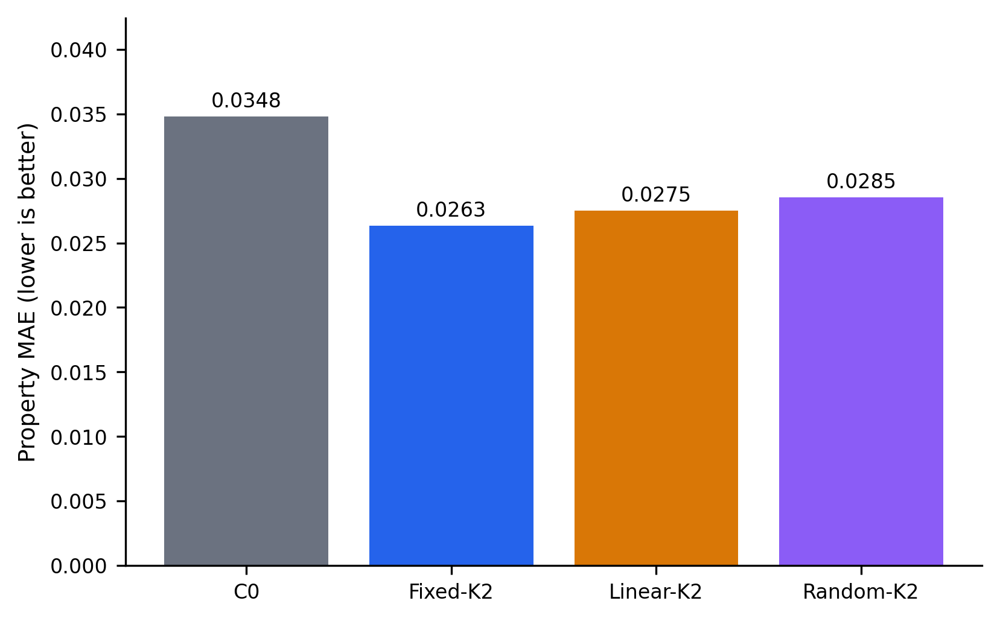
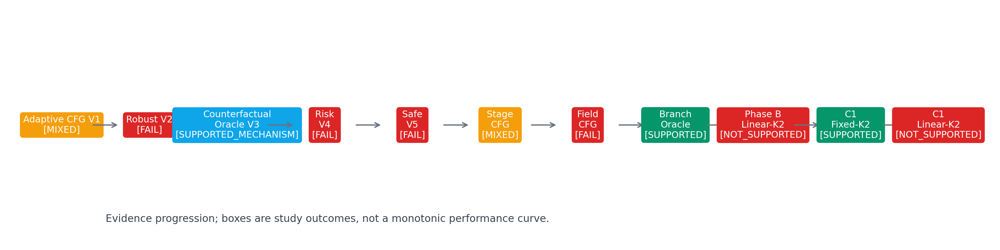
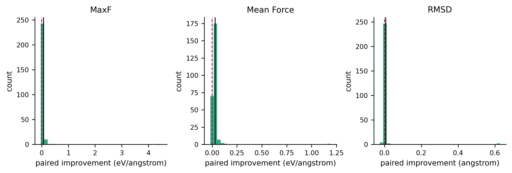
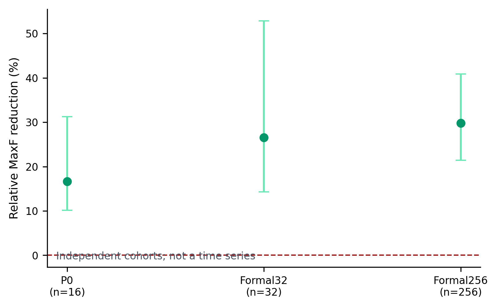
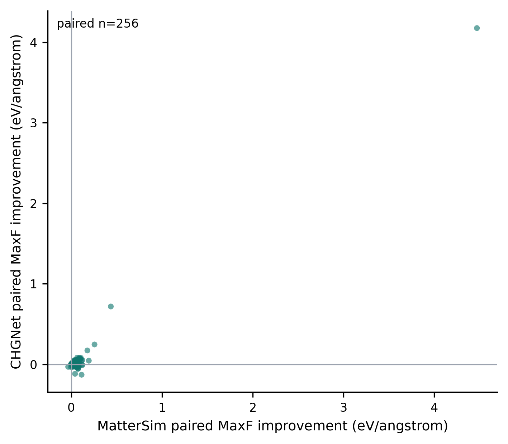
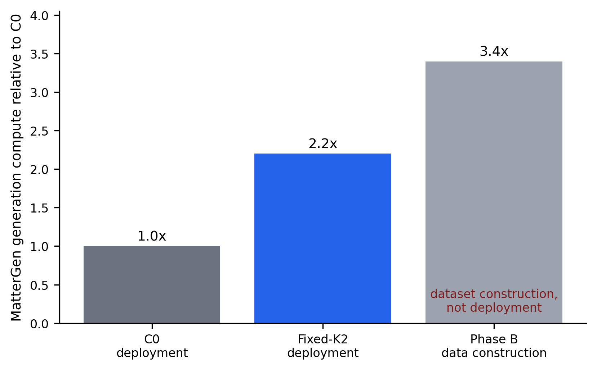

# 第5章 实验结果与综合分析

第3章和第4章分别给出了参考轨迹保留的预算约束多分支条件引导方法与基于阶段可靠性校准的后期神经力场引导扩散方法（RC-NFGD）。本章不再重复算法推导，而是从统一实验口径出发，对两项创新的确认性结果、负结果、机制证据、计算代价和适用边界进行综合分析。全文以冻结发布包中的表格、配对统计和图件为唯一数值来源，不使用新的实验，也不依据结果重新选择样本、指标或阈值。

本章的核心结论有两点。第一，在条件属性生成方面，Fixed-K2 在128个全新配对种子上将 Property MAE 从0.034796降至0.026332，相对改善24.32%，20 000次配对 bootstrap 的绝对改善95%置信区间为[0.005817, 0.011391]；同时，学习型 Linear-K2 未能在相同2.2倍预算下独立确认优于 Fixed-K2。第二，在局部结构一致性方面，RC-NFGD 在256个正式配对种子上将 MatterSim MaxF、Mean Force 和松弛 RMSD 分别降低29.81%、29.72%和14.17%，并在 CHGNet 上得到方向一致但幅度较小的均值改善。两项创新分别解决“条件控制的保守选择”和“生成期局部力学反馈”问题；现有兼容性实验不支持二者具有稳定协同，因此不能合并写成已经验证的联合模型。

## 5.1 实验设置与评价协议

### 5.1.1 证据层级与实验角色

为避免把探索结果、机制诊断和正式确认混为一谈，本研究按实验用途划分证据层级。探索性实验用于暴露失败模式和收缩研究空间；机制实验用于判断某一信息源或设计环节是否具有可利用价值；模型选择实验允许在训练集和验证集上确定候选，但必须由留出测试或后续新种子复核；确认实验则使用冻结方法、冻结主指标和全新种子承担最终结论。小规模 P0 只决定是否进入下一阶段，不替代正式证据。各关键实验的角色见表5-1。

**表5-1 关键实验、样本规模与证据类型**

| 创新点 | 实验 | 数据规模 | 证据类型 | 冻结结论 | 在本章中的作用 |
|---|---|---:|---|---|---|
| 创新点1 | Adaptive CFG V1/V2/V4/V5、阶段与字段变体 | 依实验而异 | 探索/机制 | MIXED 或 FAIL | 说明在线局部统计难以稳定预测终点收益 |
| 创新点1 | Branch-Compatible Oracle | 历史48，测试12 | 探索性机制上界 | SUPPORTED_MECHANISM | 证明合法分支预算内存在可利用空间，不代表可部署选择器 |
| 创新点1 | Phase B Linear-K2 | 64（32/16/16） | 模型选择与留出测试 | NOT_SUPPORTED | 检验学习型候选分配是否优于固定分配 |
| 创新点1 | C1 Fixed-K2 | 128对 | 确认实验 | SUPPORTED | 支撑最终 Fixed-K2 主结论 |
| 创新点1 | C1 Linear-K2 | 128对 | 负确认实验 | NOT_SUPPORTED | 否定当前学习型分配器的额外价值 |
| 创新点2 | 阶段可靠性诊断 | 32 | 机制/校准 | SUPPORTED | 冻结后期介入窗口，不用于估计正式效应 |
| 创新点2 | RC-NFGD P0 | 16对 | 可行性筛选 | PASS | 允许进入 Formal32 |
| 创新点2 | RC-NFGD Formal32 | 32对 | 独立复现 | PASS | 确认小样本效应方向可复现 |
| 创新点2 | RC-NFGD Formal256 | 256对 | 正式确认 | SUPPORTED | 支撑 RC-NFGD 的主要效果结论 |
| 创新点2 | CHGNet Formal256 | 同一256对 | 独立于引导过程的跨代理评价 | POSITIVE | 降低只适配 MatterSim 的解释风险，但不是 DFT |
| 创新点2 | 方向、边界、等预算与兼容性消融 | 32或64对 | 机制与边界 | SUPPORTED/NOT_SUPPORTED/FAIL | 限定因果解释、替代方案与联合使用边界 |

所有核心比较均采用 matched-seed 设计，即同一比较中的基准与方法从相同随机种子启动。创新点1的 C1 在历史实验之外注册全新种子；创新点2的 P0、Formal32 与 Formal256 使用彼此分离的新 cohort。每个阶段均保留全部预注册样本，不因结果异常或方向不利而替换。这样的设计不能消除代理模型偏差，却能显著减少随机初态差异对方法比较的干扰。

### 5.1.2 指标与统计口径

条件属性控制以 Property MAE 为主要指标，数值越低表示生成结构的代理属性越接近目标条件。E-hull 越低、Stable 比例越高通常代表代理热力学质量更好；Validity 衡量结构能否通过基本有效性检查；Novel、Unique 和 NUS 分别反映新颖性、唯一性及其交集。创新点1还报告候选接受率和回退率，用于区分“候选分支本身有效”与“终点选择加回退后输出有效”。

局部结构一致性以神经势预测的最大原子力 MaxF、平均原子力 Mean Force 以及代理松弛前后的 RMSD 为主要指标，三者均为越低越好。创新点2同时检查 Property MAE、Stable、Validity、E-hull、Novel、Unique 和 NUS，以识别力指标改善是否伴随条件控制或分布质量退化。MatterSim 指标属于与引导器同源的代理评价，CHGNet 指标属于不参与力反馈的跨势评价，两者的证据强度和解释范围不同。

主要连续指标采用20 000次确定性配对 bootstrap。对于“越低越好”的指标，改善定义为基准值减去方法值，因此正值表示有利；报告相对改善时也沿用这一符号。胜/平/负（W/T/L）按逐样本配对结果统计。置信区间完全高于零时，可认为该冻结 cohort 对有利方向提供统计支持；区间跨零时，只报告点估计方向而不宣称优势成立。Stable、Validity 等比例型护栏主要用于预注册判定和描述，不在缺少相应区间时扩展为显著性结论。

### 5.1.3 代理评价边界

本研究没有执行 DFT 计算，`DFT_VERIFIED = false`。CHGNet 在创新点1中承担属性、能量和部分质量评价；MatterSim 在创新点2中既产生在线力反馈，又承担主要力学指标评价，因此存在评价器自洽风险。CHGNet Formal256 没有参与 RC-NFGD 的力反馈，可用于检验方向是否跨神经势保持，但 CHGNet 仍是机器学习原子间势，并且不能排除训练数据关系或共享任务偏差。因而本章所称“物理一致性改善”均指代理局部结构指标改善，不等价于真实 DFT 力降低、材料稳定性证明或实验可合成性验证。

## 5.2 条件属性生成结果的综合分析

### 5.2.1 C1-128 主结果

表5-2汇总 C1-128 的四臂结果。Fixed-K2 的 Property MAE 为0.026332，低于 C0 的0.034796、Random-K2 的0.028533和 Linear-K2 的0.027522，形成 `Fixed-K2 < Linear-K2 < Random-K2 < C0` 的均值次序。Fixed-K2 相对 C0 的绝对改善为0.008464，相对改善24.32%，20 000次配对 bootstrap 的95%置信区间为[0.005817, 0.011391]，全区间高于零。逐样本共有53个改善、75个持平或回退、0个最终损失。

**表5-2 创新点1 C1-128 最终确认结果**

| 方法 | Property MAE ↓ | E-hull ↓ | Stable ↑ | Novel ↑ | Unique ↑ | NUS ↑ | Validity ↑ | 回退率 | 计算量/C0 |
|---|---:|---:|---:|---:|---:|---:|---:|---:|---:|
| C0 | 0.034796 | 0.104296 | 58.59% | **71.09%** | 99.22% | 32.81% | 100% | 100% | 1.0× |
| Fixed-K2 | **0.026332** | **0.081135** | **70.31%** | 65.63% | **100%** | 37.50% | 100% | 58.59% | 2.2× |
| Linear-K2 | 0.027522 | 0.090528 | 67.97% | 67.97% | **100%** | **39.06%** | 100% | 59.38% | 2.2× |
| Random-K2 | 0.028533 | 0.089172 | 64.84% | 71.88% | 99.22% | **39.06%** | 100% | 66.41% | 2.2× |

图5-1直观呈现四种方法的总体误差，但均值排序本身不足以说明确认性成立。Fixed-K2 的关键证据是配对改善区间完全高于零，而且确认种子与历史选型数据零重叠。相比之下，Linear-K2 虽然也低于 C0，却没有在同预算下超过 Fixed-K2。Random-K2 的结果说明“任意展开两个分支并终点筛选”已经可能借助回退优于 C0，但冻结的候选组合仍取得最低 MAE；因此，结果同时支持终点保守选择的普遍价值与候选库设计的具体价值。

### 5.2.2 属性收益与质量护栏的关系

Fixed-K2 的 E-hull 从0.104296降至0.081135 eV/atom，Stable 从58.59%提高到70.31%，NUS 从32.81%提高到37.50%，Validity 保持100%。MaxF 从0.385927降至0.358976 eV/Å，松弛 RMSD 从0.075983降至0.067294 Å。上述结果说明在冻结代理协议下，属性改善没有通过牺牲这些已注册质量护栏获得。

但“所有质量指标均改善”并不成立。Fixed-K2 的 Novel 从71.09%降至65.63%，低于 C0；其 NUS 上升是 Novel、Unique 与 Stable 联合后的结果，不能用 NUS 的提高掩盖单独 Novel 指标的下降。表5-2保留这一差异，是因为条件准确性、稳定性和生成分布覆盖之间并非天然同向。最终结论应是“冻结护栏通过且若干代理质量指标改善”，而不是“生成质量全面提高”。

53/75/0 的配对结果也需要结合方法定义解释。Fixed-K2 保留精确 C0 后缀，并且只有在候选终点属性更优且质量条件通过时才接受候选，否则返回 C0。0个最终损失主要验证了终点约束选择与参考回退按设计工作，并不证明 GPulse 和 PPulse 两条候选分支从不产生坏样本。58.59%的回退率意味着128个样本中有75个没有用候选替换参考输出；方法收益集中在能够通过终点验证的剩余样本上。这种稀疏接受模式正是其稳定性来源，也是2.2倍预算未对所有样本转化为输出变化的原因。

### 5.2.3 结果的科学含义

创新点1的确认结果支持一种保守的计算换可靠性策略：在精确保留基准轨迹的前提下，只对后缀展开少量候选，并把不可逆的在线决策转化为可回退的终点决策。它没有证明某个动态 CFG 规则可以在单轨迹中持续做出正确动作，也没有证明 Fixed-K2 在每一种属性任务或每一种2.2倍预算方法中最优。其最强可辩护表述是：在当前 MatterGen 磁性密度条件任务、冻结候选集合和 CHGNet 代理评价下，参考保留的固定双分支选择在全新 C1-128 上提高了条件属性准确性，并通过预注册代理质量护栏。

## 5.3 Fixed-K2、Linear-K2 与参考保留多分支有效性

### 5.3.1 从在线控制失败到分支上界

创新点1并非由单次正实验直接得到。早期 Adaptive CFG V1 在历史 Formal256 上呈现混合结果，后续新批次未稳定复现；加入时间归一化、中位数聚合、置信回退和限速的 Robust V2 在新 P0 上失败；风险校准 V4、安全选择 V5、阶段门控和字段解耦也没有通过各自冻结门槛。这些相互独立的负结果表明，局部残差、短视野标签或简化风险分数不足以稳定预测完整终点的属性—质量结果。

与此同时，反事实和分支兼容 Oracle 显示优化空间确实存在。Branch-Compatible Oracle 在历史独立测试划分12个样本上将 Property MAE 从0.028799降至0.020041，相对改善30.41%；Oracle-K2 在该小样本上恢复了 Oracle-All 的全部观察到的优化空间。由于 Oracle 使用事后终点信息，这一结果只能证明“有限候选中存在更好选择”，不能作为可部署性能。它的研究价值在于把失败原因从“没有可改善空间”定位为“在线识别不可靠”，从而合理引出参考轨迹保留与终点验证。

图5-2中的状态不是简单的迭代分数，也不意味着后出现的方法必然优于前一方法。它记录的是研究假设如何被证据逐步收缩：在线自适应的宽泛命题没有被支持；Oracle 支持“选择空间存在”；最终 C1 支持的是更窄的“固定候选、参考保留、终点约束选择”命题。负结果因此不是被最终正结果覆盖，而是决定了最终创新主张的边界。

### 5.3.2 Phase B 学习型分配器

Phase B 使用64个全新样本，按32/16/16划分训练、验证和测试集合。Linear-K2 基于分支前179个原始特征学习每个样本的候选优先级。留出测试上，Linear-K2 的 Property MAE 为0.023634，Fixed-K2 为0.024597，点估计方向相当于3.92%的相对改善；然而 Linear-K2 相对 Fixed-K2 的绝对配对增益95%置信区间为[-0.002618, 0.005214]，跨越零，未通过预注册分配器优势门槛。因此 Phase B 的冻结结论是 `ADAPTIVE_ALLOCATION_VALUE = NOT_SUPPORTED`。

由于当时缺失序列化模型，后续在注册任何确认种子之前，使用原训练32样本、原代码、179个特征和已确定的 \(C=1.0\) 做了一次确定性重建。重建模型对历史16个测试样本的 Top-2 选择实现16/16完全一致，验证/测试指标最大绝对误差为 \(1.11\times10^{-16}\)，随后以 `RECONSTRUCTED_ARTIFACT` 和 SHA-256 哈希冻结。该过程只恢复历史对象，不改变 Phase B 的负结论，也不构成结果后的重新训练。

### 5.3.3 C1 中的直接检验

在全新 C1-128 上，Linear-K2 的 MAE 为0.027522，高于 Fixed-K2 的0.026332。若把 Linear 相对 Fixed 的有利差定义为 \(E_{\mathrm{Fixed}}-E_{\mathrm{Linear}}\)，平均值为-0.001190，相对值为-4.52%，20 000次配对 bootstrap 区间为[-0.003148, 0.000740]，W/T/L 为31/62/35。方向没有优于 Fixed，区间又跨零；C1 的继续门槛因此失败，预留的 C2 按协议不运行，也没有进行补救调参。

Linear-K2 相对 C0 仍有改善，原因是它与 Fixed-K2 共用终点约束选择和精确回退框架。由此可以分离两类贡献：参考保留、有限分支和终点回退得到 C1 支持；当前特征、样本规模与线性模型实现的学习型样本分配没有得到额外支持。最终采用 Fixed-K2 不是因为“简单模型原则”先验压倒了学习方法，而是因为在匹配预算和独立样本上，复杂分配器没有提供可确认的增益。

## 5.4 RC-NFGD 的物理一致性改善

### 5.4.1 Formal256 主结果

Formal256 使用256个注册配对种子，C0 与 RC-NFGD 均完成256/256。表5-3给出冻结主结果。MatterSim MaxF 从0.226408降至0.158911 eV/Å，相对降低29.81%，相对改善95%置信区间为[21.42%, 40.88%]，W/T/L 为254/0/2。Mean Force 从0.098702降至0.069373 eV/Å，相对降低29.72%，区间为[24.01%, 36.96%]。松弛 RMSD 从0.051137降至0.043893 Å，相对降低14.17%，区间为[4.54%, 25.95%]。三项区间均位于有利方向。

**表5-3 RC-NFGD Formal256 正式结果**

| 指标 | C0 | RC-NFGD | 有利相对变化 | 95% CI | W/T/L | 解释 |
|---|---:|---:|---:|---:|---:|---|
| MatterSim MaxF（eV/Å）↓ | 0.226408 | **0.158911** | **29.812%** | [21.417%, 40.876%] | 254/0/2 | 预注册主终点，支持 |
| MatterSim Mean Force（eV/Å）↓ | 0.098702 | **0.069373** | **29.715%** | [24.012%, 36.963%] | 255/0/1 | 支持 |
| 松弛 RMSD（Å）↓ | 0.051137 | **0.043893** | **14.165%** | [4.538%, 25.953%] | 216/21/19 | 支持 |
| Property MAE ↓ | **0.009757** | 0.009868 | **-1.141%** | [-2.460%, -0.225%] | 95/0/161 | 轻微但方向明确的恶化 |
| Stable ↑ | 80.86% | 80.86% | 0 | [0, 0] | 0/256/0 | 保持 |
| Validity ↑ | 100% | 100% | 0 | [0, 0] | 0/256/0 | 保持 |

MaxF 与 Mean Force 的胜负高度偏向 RC-NFGD，说明均值改善不是由极少数样本独立驱动。RMSD 的损失数更多、效应更小，符合“生成期力反馈主要改善代理局部受力，但对松弛位移的映射并非一一对应”的预期。MatterSim MaxF 的 P90 从0.390303降至0.329501 eV/Å，P95 从0.744050降至0.677620 eV/Å，最大值从5.375634降至3.429568 eV/Å；这些尾部描述支持同一方向，但不是替代预注册均值主检验的额外主终点。

### 5.4.2 跨 cohort 可复现性

在方法冻结的三阶段证据链中，P0、Formal32 和 Formal256 的 MatterSim MaxF 相对降低分别为16.66%、26.57%和29.81%，相应区间分别为[10.17%, 31.24%]、[14.27%, 52.86%]和[21.42%, 40.88%]。三个 cohort 的样本规模、种子和绝对难度不同，不能把效应量递增解释为随样本规模增长的性能曲线；可以确认的是，三个相互分离的样本集合均保持正向区间，且方法在阶段间没有根据结果改动。

这种分阶段复现比单次 Formal256 均值更能回答稳定性问题。P0 负责排除明显不可行方案，Formal32 检查初始信号是否能在新种子上重现，Formal256 则缩小不确定性并承担正式结论。不同 cohort 均给出有利方向，使 RC-NFGD 的证据强度高于仅在单个探索批次上观察到的效果；但它仍只覆盖当前 checkpoint、目标磁性密度、采样配置和代理模型。

### 5.4.3 条件属性与结构指标的权衡

RC-NFGD 没有实现所有指标同时改善。Property MAE 从0.0097569增至0.0098682，按有利方向计算为-1.14%，区间[-2.46%, -0.22%]完全位于不利方向，W/T/L 为95/0/161。Stable 保持80.86%，Validity 保持100%，因而方法通过了预注册护栏，但这不能抵消属性误差的轻微恶化。更准确的判断是：RC-NFGD 在冻结容忍范围内，以小幅条件属性代价换取较大的代理力和松弛指标改善。

这一权衡也解释了为什么创新点1和创新点2应分别评价。Fixed-K2 的主目标是属性准确性，并通过终点回退控制质量风险；RC-NFGD 的主目标是局部受力，允许在护栏范围内出现小幅属性变化。若把所有指标压缩为未经注册的单一综合分数，既会掩盖两种方法的任务差异，也可能在看到结果后人为改变结论。

## 5.5 MatterSim 与 CHGNet 跨代理对比

MatterSim 同时参与 RC-NFGD 引导与主要评价，因而仅凭 MatterSim 结果无法排除方法适配其自身能量面的可能。为此，对 Formal256 的同一256对最终结构使用 CHGNet 0.3.0 重新计算力。表5-4显示，CHGNet MaxF 从0.193891降至0.166057 eV/Å，相对改善14.36%，绝对改善区间为[0.007052, 0.064868]；Mean Force 从0.087976降至0.079541 eV/Å，相对改善9.59%，绝对区间为[0.002384, 0.019148]。两个绝对区间均高于零，均值方向与 MatterSim 一致。

**表5-4 Formal256 的 MatterSim 与 CHGNet 跨代理结果**

| 评价器 | 指标 | C0 | RC-NFGD | 相对改善 | 绝对改善95% CI | W/T/L | 证据定位 |
|---|---|---:|---:|---:|---:|---:|---|
| MatterSim | MaxF | 0.226408 | 0.158911 | 29.81% | —（相对CI见表5-3） | 254/0/2 | 同源主评价 |
| MatterSim | Mean Force | 0.098702 | 0.069373 | 29.72% | —（相对CI见表5-3） | 255/0/1 | 同源次要评价 |
| CHGNet | MaxF | 0.193891 | 0.166057 | 14.36% | [0.007052, 0.064868] | 172/0/84 | 跨势均值支持 |
| CHGNet | Mean Force | 0.087976 | 0.079541 | 9.59% | [0.002384, 0.019148] | 169/0/87 | 跨势均值支持 |

注：MatterSim 行报告冻结的相对置信区间（见表5-3），CHGNet 发布表报告绝对改善置信区间，两类区间不直接比较数值大小。

跨势结果并非完全一致。CHGNet 的效应幅度小于 MatterSim，且损失样本明显增多。CHGNet MaxF 的 P90 从0.405853升至0.425399 eV/Å，P95 从0.661234升至0.696249 eV/Å；Mean Force 中位数从0.046336升至0.048166 eV/Å，而其 P90/P95 又略有下降。这种混合尾部意味着“均值方向跨势保持”得到支持，但“每个样本、每个分位数或全部尾部风险均改善”不成立。

CHGNet 的独立性也必须准确限定。它没有向 RC-NFGD 提供在线力，因此相对于生成期引导信号是独立评价器；但它仍参与项目中的磁性属性和质量评价，而且 MatterSim 与 CHGNet 都是 MLIP，不能等同于不同实验室的盲测，更不能替代 DFT。两者方向一致降低了单一评价器自洽的解释风险，却没有消除代理误差。

## 5.6 消融结果与机制分析

表5-5把两项创新的关键机制实验统一到“支持什么、不能支持什么”的口径。消融的作用不是为最终方法的每个组件寻找正结果，而是分离必要信息、保守工程设计和未获支持的复杂化。

**表5-5 关键消融、机制证据与解释边界**

| 对象 | 实验与规模 | 关键结果 | 状态 | 支持的解释 | 不支持的解释 |
|---|---|---|---|---|---|
| 创新点1 | Branch Oracle，测试 \(n=12\) | MAE 0.028799→0.020041，改善30.41% | SUPPORTED_MECHANISM | 有限合法分支中存在终点优化空间 | Oracle 可部署或可泛化 |
| 创新点1 | Phase B Linear-K2，测试 \(n=16\) | 相对 Fixed 点估计+3.92%，CI跨零 | NOT_SUPPORTED | 可作为方向性探索 | 学习分配器已优于 Fixed |
| 创新点1 | C1 Linear-K2，\(n=128\) | 0.027522 vs Fixed 0.026332；CI跨零 | NOT_SUPPORTED | 回退框架仍可优于 C0 | 当前学习分配具有额外价值 |
| 创新点2 | 阶段可靠性，\(n=32\) | \(t=0.02\) Spearman=0.9256 | SUPPORTED | clean-x0 后期排序可用于冻结介入窗口 | 相关性证明因果最优阶段 |
| 创新点2 | Force direction，\(n=32\) | G1 MaxF 0.098500 vs G0 0.141690；改善30.48%，CI[24.66%, 38.87%] | SUPPORTED | 真实力方向携带有效局部信息 | 力方向是理论唯一最优更新 |
| 创新点2 | Bounded，\(n=32\) | T1 0.231502，unbounded T2 0.060834 | NOT_SUPPORTED | bound 可作保守幅度控制 | bound 是性能收益的必要核心 |
| 创新点2 | 等20次 MatterSim 调用，\(n=32\) | online 0.163650，POST 0.043275 | 在线优越性 NOT_SUPPORTED | 在线反馈可行且改善 C0 | RC-NFGD 优于生成后松弛 |
| 两创新 | A5 兼容性，\(n=64\) | 组合仅保留55.49%的单独力改善，低于70%门槛 | FAIL | 两种贡献应独立报告 | 已验证协同或联合最优 |

### 5.6.1 真实力方向的作用

方向消融把无引导 G0、真实力方向 G1、同尺度随机方向 G2、原子间打乱方向 G3 和反向方向 G4 放在同一32种子协议中。MatterSim Mean MaxF 分别为0.141690、0.098500、0.153744、0.151428和0.188137 eV/Å。G1 相对 G0 改善30.48%，区间完全为正；CHGNet 也得到8.00%的方向性改善及[1.64%, 13.60%]的相对区间。这比“加入任意小扰动即可改善”的解释更符合数据。

但 G2/G3/G4 重放的是配对 G1 轨迹上的位移尺度，而不是在各自新轨迹上闭环重新计算力；特别是 G4 不是沿自身势能面执行反梯度下降。扩散采样具有路径依赖，因此该消融支持真实力方向包含有用信息，却不足以证明其理论最优性或完全分离闭环状态变化。

### 5.6.2 有界修正的保守角色

去除归一化饱和和0.01 Å硬上限的 T2 在 MatterSim 上比冻结 T1 更强，并在该32样本 cohort 上通过所测护栏；CHGNet 上 T2 并未稳定优于 T1。由此不能把“有界”描述成已经验证的性能来源。最终保留 bound 的原因是它让单事件位移可解释、限制异常力的直接影响，并便于审计和跨样本控制。它属于风险偏好明确的工程约束，而不是经消融证明的最优 trust-region 算法。

### 5.6.3 在线引导与生成后修正

等预算实验对 RC-NFGD 提供了重要反例。在同为20次 MatterSim 调用时，POST 从生成终态开始连续修正，其 Mean MaxF 为0.043275，低于在线 F0 的0.163650；全部32个配对样本上，F0 相对 POST 均更差。该结果不推翻 Formal256 中“在线反馈能改善 C0”的主结论，但否定了“在线方式是获得最低代理力的最佳方式”。在线修正在后续 predictor/corrector 中可能被部分冲淡，而终态 POST 可以把全部预算直接用于当前结构的局部下降。

两者对应不同研究问题。RC-NFGD 证明神经势反馈可以可靠接入生成轨迹，POST 则是部署时若只追求同一势下低力必须保留的强基线。本研究没有验证“RC-NFGD 后再 POST”的两阶段组合，因此不能预先宣称互补收益。

### 5.6.4 复杂模型不必然优于冻结简单策略

创新点1的 Linear-K2 与创新点2的 unbounded/POST 消融共同说明，复杂度与最终科学价值并非单调关系。Linear-K2 增加特征工程和训练过程，却没有在新 C1 上超过固定策略；相反，POST 算法上更简单，却在同势同调用次数下取得更低 MaxF。最终方法选择应由预注册问题决定：创新点1需要可回退的条件属性改善，因此采用已确认的 Fixed-K2；创新点2研究生成期物理反馈，因此保留 RC-NFGD，同时承认 POST 在纯终态力目标上更强。

## 5.7 计算代价与工程可行性

表5-6汇总部署与数据构建成本。C0 每个样本需要2 000次 MatterGen score 调用。Fixed-K2 在前400步共享参考状态和随机数状态，之后分别继续 C0、GPulse 与 PPulse 三个后缀，总计4 400次 score 调用，并需3次终点评价，部署计算量约为 C0 的2.2倍。Linear-K2 使用相同2.2倍预算，因此它与 Fixed-K2 的比较不存在主网络计算量差异。Phase B 完整候选采集约3.4倍 C0，但这是构建训练数据的离线成本，不是最终 Fixed-K2 的部署成本。

RC-NFGD 与 C0 均使用2 000次 MatterGen score 调用，差别是后期增加20次 MatterSim 力调用。Formal256 记录的平均端到端时间分别为92.663 s和92.849 s，比值0.9980；该微小反向差异属于硬件与运行波动，不能宣称 RC-NFGD 加速。更稳妥的结论是，在当前硬件、batch-size-1和实现条件下，额外20次神经势调用未形成可辨识的平均总时延增长。跨 GPU、批量大小或更大结构时仍需重新测量。

**表5-6 计算代价与部署条件**

| 方法/阶段 | 角色 | MatterGen score 调用/样本 | 神经势调用/样本 | 相对 C0 计算量或时间比 | 回退率 | 工程解释 |
|---|---|---:|---:|---:|---:|---|
| 创新点1 C0 | 基准部署 | 2 000 | 1次终点评价 | 1.0× | 100% | 精确参考 |
| Fixed-K2 | 最终部署 | 4 400 | 3次终点评价 | 2.2× | 58.59% | 以额外后缀计算换取终点选择 |
| Linear-K2 | 负确认 | 4 400 | 3次终点评价 | 2.2× | 59.38% | 与 Fixed 匹配预算，未确认额外收益 |
| Phase B 全候选采集 | 离线数据构建 | — | — | 约3.4× | — | 不应写作部署开销 |
| 创新点2 C0 | Formal256基准 | 2 000 | 0次在线MatterSim | 1.0× | 0 | 与RC-NFGD匹配主网络调用 |
| RC-NFGD | 最终部署 | 2 000 | 20次在线 MatterSim | 时间比0.9980 | 0 | 主网络调用不增加；无加速主张 |

从部署选择看，两项创新具有不同成本结构。Fixed-K2 需要保存中间采样器与 RNG 状态、克隆后缀并缓存多个候选，适合可以接受约2.2倍生成预算、且终点评价器可用的离线筛选任务。RC-NFGD 不增加 MatterGen score 次数，但引入 MatterSim 依赖、周期坐标转换和20次在线调用，更适合对生成轨迹中的局部几何一致性有明确需求的场景。二者都不是训练阶段的参数微调，也不需要修改基础 MatterGen 权重。

## 5.8 两项创新的关系与联合实验结论

两项创新共享三个研究原则：使用冻结的 MatterGen 基础模型；用配对种子隔离随机性；在方法失败时保留精确基准或原 score 回退。但它们作用于不同层面。Fixed-K2 是轨迹级候选管理方法，主要通过多后缀生成和终点选择改善条件属性；RC-NFGD 是步级坐标反馈方法，在可靠后期窗口内改变 position predictor，主要改善代理受力。前者把风险延迟到终点决策，后者在采样过程中主动介入。

兼容性 A5 在64个配对种子上比较 C0、Adaptive CFG A0、单独力引导 B0 与组合 AB。Mean MaxF 分别为0.218922、0.239629、0.171833和0.192794 eV/Å。组合方法保留约97.45%的 Adaptive CFG 属性改善，但只保留约55.49%的单独力引导改善，低于预注册70%双保持门槛，最终状态为 FAIL。该实验测试的是历史 Adaptive CFG 与力引导的组合，而不是最终 Fixed-K2 的完整笛卡尔积组合；它足以否定“现有证据已证明两项创新协同”，却不足以断言任何未来组合都不可能有效。

因此，论文应把二者组织为同一材料逆向生成问题下的两类互补研究视角，而不是一个已经验证的联合算法。创新点1回答“如何在有限候选预算内保留条件控制的安全基线”；创新点2回答“何时以及如何把神经势局部反馈接入生成轨迹”。共同使用时可能产生预算、选择器自洽和属性—力权衡的新问题，必须经过单独预注册与全新种子确认。本论文不把这种尚未完成的工作计入创新贡献。

## 5.9 适用范围、威胁与局限性

### 5.9.1 内部有效性

配对种子、方法冻结、阶段门控和完整样本保留增强了内部有效性。创新点1通过重建审计恢复并哈希固定 Linear-K2，且重建发生在 C1 种子注册前；创新点2通过实现锁、独立 cohort 和逐级 GO 规则防止在看到 Formal256 后修改方法。20 000次配对 bootstrap 与 W/T/L 同时报告，避免只依赖单一均值。

内部有效性仍受代理选择影响。Fixed-K2 只有在 CHGNet 终点评价下才执行接受或回退，因而0损失与该评价规则存在算法性联系；RC-NFGD 由 MatterSim 产生力又用 MatterSim 评价，主效应可能包含同源优势。CHGNet 跨势评价降低但未消除这一风险。部分消融样本量为32，适合机制定位，不应拥有与 Formal256 等同的外推权重。

### 5.9.2 外部有效性与应用边界

实验集中在当前 MatterGen checkpoint、磁性密度目标0.2及既定采样设置。Fixed-K2 的分支点、GPulse/PPulse 候选和终点阈值不保证迁移到其他属性；RC-NFGD 的 \(t=0.02\) 可靠阶段、参考力、0.005 Å名义位移、0.01 Å硬上限和0.5 Å最小距离也不保证适用于其他元素分布、晶体规模、扩散模型或神经势。跨任务使用时，至少需要重新做阶段诊断、候选校准和全新确认，而不能直接复用当前效应量。

本研究没有 DFT、声子、长时间分子动力学或湿实验验证。E-hull、Stable、MaxF 和 RMSD 均是代理量，不能充分覆盖动力学稳定性、合成可行性、缺陷效应和温压条件。Novel 与 Unique 依赖所用参考库和结构匹配规则，也不能直接等价为具有实验价值的新材料。

### 5.9.3 结论强度与未解决问题

表5-7给出论文最终 Claim–Evidence 映射。该表区分“得到确认的效果”“有助于解释的机制”和“被实验否定或尚未验证的更强命题”，用于约束摘要、结论和答辩表述。

**表5-7 最终 Claim–Evidence 对照**

| Claim | 主要证据 | 证据类型 | 状态 | 允许的结论 | 主要限制 |
|---|---|---|---|---|---|
| 合法分支预算内存在属性改善空间 | Branch Oracle 测试 \(n=12\)，30.41% headroom | 探索性机制上界 | SUPPORTED_MECHANISM | 多分支设计有机制依据 | Oracle 使用事后信息且样本小 |
| Fixed-K2 优于 C0 | C1-128，MAE改善24.32%，CI[0.005817, 0.011391] | 确认 | SUPPORTED | 冻结任务与代理协议下属性控制改善 | 2.2×预算；不保证跨任务 |
| Fixed-K2 通过质量护栏 | E-hull、Stable、NUS改善，Validity不变 | 确认护栏 | SUPPORTED | 已注册代理护栏未被破坏 | Novel 单项下降；无 DFT |
| Linear-K2 优于 Fixed-K2 | Phase B CI跨零；C1均值更差且CI跨零 | 负确认 | NOT_SUPPORTED | 当前学习分配无确认增益 | 不否定未来更强数据/模型 |
| 在线 Adaptive CFG 稳定有效 | V1混合，V2/V4/V5/Field失败，Stage混合 | 多轮探索 | NOT_SUPPORTED | 其失败推动参考保留框架 | 不能写作最终已验证方法 |
| RC-NFGD 降低 MatterSim 力与 RMSD | Formal256 三指标区间均为正 | 正式确认 | SUPPORTED | 代理局部结构一致性改善 | MatterSim 同源评价风险 |
| RC-NFGD 跨势方向保持 | CHGNet MaxF与Mean Force绝对CI均高于零 | 独立于引导的代理评价 | SUPPORTED | 均值力指标跨 MLIP 同向 | 效应较小、尾部混合、非 DFT |
| RC-NFGD 改善目标属性 | Property MAE恶化1.14%，不利区间不跨零 | 正式护栏 | NOT_SUPPORTED | 可报告小幅属性代价 | 不能用 Stable/Validity 掩盖 |
| bound 是性能核心 | unbounded T2 的 MatterSim 均值更低 | 消融 | NOT_SUPPORTED | bound 是保守控制 | 非最优性证明；组件未单独拆分 |
| RC-NFGD 优于等预算 POST | POST Mean MaxF 0.043275，online 0.163650 | 等预算消融 | NOT_SUPPORTED | 在线反馈可行但不是最低力方案 | 仅当前势、预算与小样本 |
| 两项创新具有联合协同 | A5 力收益保留55.49%<70%门槛 | 兼容性 | FAIL | 两项创新独立报告 | 未直接验证 Fixed-K2×RC-NFGD |
| 方法已获真实物理验证 | 发布包无 DFT 或实验 | 证据缺失 | FALSE | 只作 surrogate-only 表述 | `DFT_VERIFIED=false` |

从表5-7可以看出，本论文的贡献并非“所有尝试均成功”。创新点1的价值来自对在线 Adaptive CFG 不稳定性的系统定位，以及最终把宽泛自适应命题收缩为可确认的参考保留多分支策略；创新点2的价值来自对生成期神经力反馈的可复现验证，同时通过方向、边界、POST 和跨势实验排除过强解释。保留负结果使最终主张更窄，但也使其可审计、可复现并更适合作为硕士论文的工程与科学贡献。

### 5.9.4 对研究问题的逐项回答

综合全部冻结证据，可以对本论文实验部分的研究问题作出四项明确回答。第一，固定强度的条件引导并非对全部样本都达到可观察的最优终点；反事实与分支兼容 Oracle 均显示剩余空间，但仅凭中间残差提前判断该空间并不可靠。第二，在当前样本规模和特征表示下，稳定收益来自“保留精确参考、展开少量候选、终点验证并回退”，而不是学习器对候选身份的逐样本预测。Fixed-K2 的确认性正结果与 Linear-K2 的负确认共同支撑这一回答，二者缺一不可。

第三，神经势可以作为生成期局部反馈接入 MatterGen，但应在 clean-x0 与终点受力具有较强排序一致性的后期窗口使用。三组独立 cohort 的同向效应、真实方向消融和 CHGNet 跨势均值结果共同表明，RC-NFGD 的收益不宜仅解释为单批随机波动或任意坐标噪声；同源评价和控制分支的路径依赖仍使“真实物理最优”超出证据范围。第四，条件属性准确性与低代理受力不是天然一致的目标。创新点1在额外分支预算下优化前者，创新点2在基本不增加主网络调用的条件下改善后者，却产生小幅属性代价；兼容性失败进一步说明，分别有效的模块不能未经确认直接组合为更强系统。

由此，本研究给出的不是一个覆盖全部目标的单一最优采样器，而是一套有明确适用条件的决策依据：若任务优先级是条件属性准确性且允许增加生成预算，应采用 Fixed-K2；若重点是研究生成轨迹内的代理力反馈，可采用 RC-NFGD；若唯一目标是同一 MatterSim 势下的最低终态受力，当前等预算证据反而要求把 POST 作为更强基线。对于同时要求属性、局部力学和计算预算的应用，应先定义可接受的权衡与门槛，再开展新的联合确认，不能从本章单项结果直接推导部署最优解。

## 本章小结

本章在统一评价口径下综合分析了两项创新。创新点1中，Fixed-K2 在全新 C1-128 上把 Property MAE 从0.034796降至0.026332，相对改善24.32%，配对改善区间完全高于零，并通过冻结的 E-hull、Stable、NUS 和 Validity 护栏；其代价是约2.2倍 MatterGen score 调用，且 Novel 单项下降。参考回退带来的53/75/0结果证明的是终点保守选择有效，而不是候选分支从不失败。学习型 Linear-K2 在 Phase B 和 C1 中都没有确认优于 Fixed-K2，因此最终贡献是固定双分支与安全回退，不是学习型候选分配。

创新点2中，RC-NFGD 在 Formal256 上将 MatterSim MaxF、Mean Force 和 RMSD 分别降低29.81%、29.72%和14.17%，并在P0、Formal32和Formal256三个独立 cohort 上保持正向效应。CHGNet 对同一256对结构给出 MaxF 14.36%和 Mean Force 9.59%的均值改善，为跨神经势方向一致性提供支持。然而，Property MAE 恶化1.14%，CHGNet 部分尾部指标变差，unbounded 消融不支持 bound 是性能核心，等预算 POST 的代理力更低。因此 RC-NFGD 应被表述为得到确认的在线代理力反馈方法，而非真实物理验证或所有替代方法中的最优方案。

两项创新可以共同支撑“条件准确性与局部结构一致性需要分别建模和验证”的论文主线，但当前联合兼容实验失败，不能宣称协同。最终冻结状态为：`INNOVATION1_FIXED_K2 = SUPPORTED`，`LINEAR_K2 = NOT_SUPPORTED`，`INNOVATION2_RC_NFGD = SUPPORTED`，`JOINT_SYNERGY = NOT_SUPPORTED`，`DFT_VERIFIED = false`。本章没有新增外部文献事实，方法背景和代理模型文献沿用第3章、第4章，故 `CITATION_NEEDED_COUNT = 0`。
